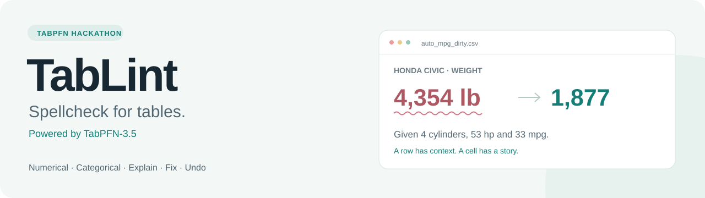
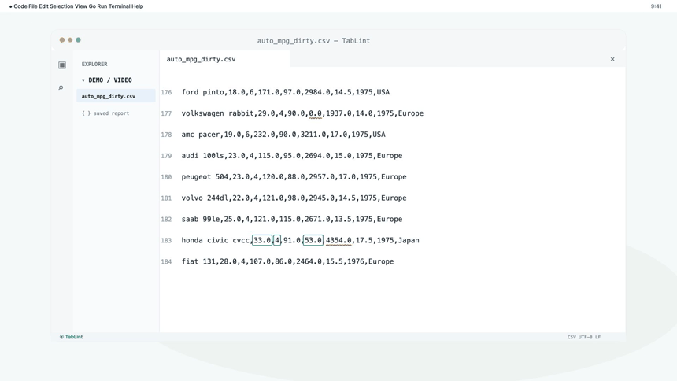
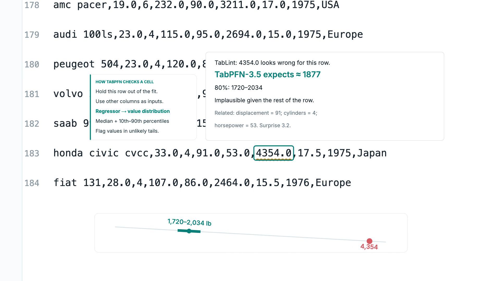

<p align="center">
  
</p>
<p align="center">
  <a href="https://github.com/James-Begin/TabLint/actions/workflows/ci.yml"></a>
  <a href="LICENSE"></a>
  
  
</p>
<p align="center">
  <a href="#try-it"><b>Try it</b></a> · <a href="#demo"><b>Watch the demo</b></a> · <a href="#how-it-works"><b>How it works</b></a> · <a href="docs/PROOFREAD_RESULTS.md"><b>Benchmarks</b></a>
</p>

TabLint finds values that look ordinary in a column but suspicious **for their row**. It uses TabPFN-3.5 to check numerical cells, categorical values and labels, explains each flag, and helps you review a suggested correction.

A Honda Civic with four cylinders and 53 horsepower is recorded at **4,354 lb**. The saved demo report expects about **1,877 lb**, with an 80% interval of **1,720–2,034 lb**. TabLint brings that evidence into your editor.

## Demo

[](https://github.com/James-Begin/TabLint/blob/main/demo/showcase/TabLint-demo.mp4)

**[Watch / download the full 1:28 showcase](https://github.com/James-Begin/TabLint/raw/refs/heads/main/demo/showcase/TabLint-demo.mp4)** · [Editable animation](showcase/) · [Demo data](demo/video/)

The animation recreates the VS Code workflow. Numerical examples use saved inference results; the specific USA → Japan suggestion is illustrative. [Provenance and review](demo/showcase/README.md).

## Try it

### One command to open the VS Code demo

Install **[Node.js 22+](https://nodejs.org/)** and **[VS Code](https://code.visualstudio.com/)** with `code` on your PATH, then run:

```sh
git clone https://github.com/James-Begin/TabLint.git && cd TabLint && npm run demo
```

This builds and installs the extension, creates working copies of the demo CSV and its saved report, and opens VS Code at the Civic row. **No Python, GPU, API key or model download is needed for this replay.**

1. Hover the underline on `4354.0` to see the expectation and explanation.
2. Inspect the Rabbit's `0.0` horsepower value. Use **Quick Fix** (`Ctrl+.` / `Cmd+.`) to replace it with `70`, flag it for review, or dismiss it.
3. Run **TabLint: Open decision ledger** from the Command Palette to inspect the reason and undo a decision.

**Prefer no build tools?** [Download the demo kit](https://github.com/James-Begin/TabLint/raw/refs/heads/main/demo/showcase/TabLint-demo-kit.zip), extract it, install the included VSIX, and open its CSV in VS Code.

Your original demo files stay intact; edits live in `demo/.workspace/`. Use `npm run doctor` if setup fails. [Manual installation and troubleshooting →](docs/GETTING_STARTED.md)

### Check your own CSV

With **[uv](https://docs.astral.sh/uv/getting-started/installation/)** installed, from the repository:

```sh
uv run tablint check data.csv --out reports/data
uv run tablint view reports/data.json
```

`uv` prepares the Python 3.12 environment automatically. Live checks need TabPFN weights and first-use model-license acceptance; inference uses a GPU when available or falls back to CPU. Saved reports replay without weights. The `proofread` command and Python package remain compatible aliases.

For a browser demo: `uv run --extra demo tablint app`. For notebooks: [Python and notebook guide](docs/GETTING_STARTED.md#python-and-notebooks).

## Features

| Feature | What you get |
| --- | --- |
| **Numerical checks** | Row-specific expectations, 80% plausible ranges, and hints for decimal slips, swapped digits, sign flips and missing-value zeros. |
| **Categorical checks** | Low-cardinality categories scored against the rest of the row, with likely alternatives and possible typo hints. |
| **Review in VS Code** | CSV squiggles, hover explanations, Quick Fix actions and a Problems list. |
| **Decision ledger** | Before/after values, reasons, timestamps and review notes; undo protects newer manual edits. |
| **More ways to work** | Terminal viewer, pandas/Jupyter widget, browser viewer, CLI, Python API and MCP tools. |
| **Replayable reports** | JSON, highlighted HTML, Markdown and an issues CSV, with saved demos for a quick first run. |



## How it works

For each column, TabLint asks TabPFN to predict a cell from the other columns. It uses **out-of-fold predictions**, so the row being checked is held out of that fold's context.

- **Numbers:** score the recorded value against TabPFN's predictive distribution; show the median and 10th–90th percentiles. Test common slips for a possible explanation.
- **Categories and labels:** use the classifier's probability for the recorded class, then suggest a more likely class for review.
- **Decisions:** a person accepts, flags or dismisses the suggestion. The VS Code ledger records the action and model reason beside the CSV.

A flag means **check the source record**, not a confirmed error. Surprise scores rank anomalies; they are not calibrated probabilities that a value is wrong. [Implementation](proofread/core.py) · [Technical and research overview](docs/RESEARCH_OVERVIEW.md)

## Evidence

In the pre-registered injected-error benchmarks, TabLint beat the best baseline selected separately for each dataset on **13/14 numerical datasets** and **10/10 categorical datasets**. The tests use synthetic corruptions on public tables; these results do not guarantee performance on a new dataset.

[Numeric results](docs/PROOFREAD_RESULTS.md) · [Categorical results](docs/CATEGORICAL_RESULTS.md) · [Pre-registrations](docs/PREREGISTRATIONS.md) · [Model comparison](docs/VERSION_COMPARISON.md)

Independent columns provide little context for this approach; high-cardinality identifiers and free text are not treated as categories. Live inference cost grows with the columns and folds. The extension supports comma-separated CSVs with one record per line. [Limitations and reproducibility](docs/RESEARCH_OVERVIEW.md#limitations).

## Project guide

| Start here | Contents |
| --- | --- |
| [Getting started](docs/GETTING_STARTED.md) | Setup, saved replay, live checks and troubleshooting |
| [VS Code extension](vscode-proofread/) | Editor workflow and persistent ledger |
| [Python engine](proofread/) | Inference, reports, terminal and notebook interfaces |
| [Demo](demo/video/) / [showcase](showcase/) | Attributed data, approved video and animation source |
| [Benchmarks](benchmarks/) / [results](results/) | Reproduction scripts and measured artifacts |
| [Contributing](CONTRIBUTING.md) | Development and verification commands |

Built for the TabPFN hackathon. The original research modules remain in `chainofcustody/` and `auditkit/`; they are documented separately in [the research overview](docs/RESEARCH_OVERVIEW.md).

## License

Code: **[Apache-2.0](LICENSE)**. [Auto MPG demo data](demo/video/README.md): UCI, CC BY 4.0. TabPFN weights, dependencies and bundled fonts retain their own licenses; weights are not redistributed. [Notices](NOTICE).
