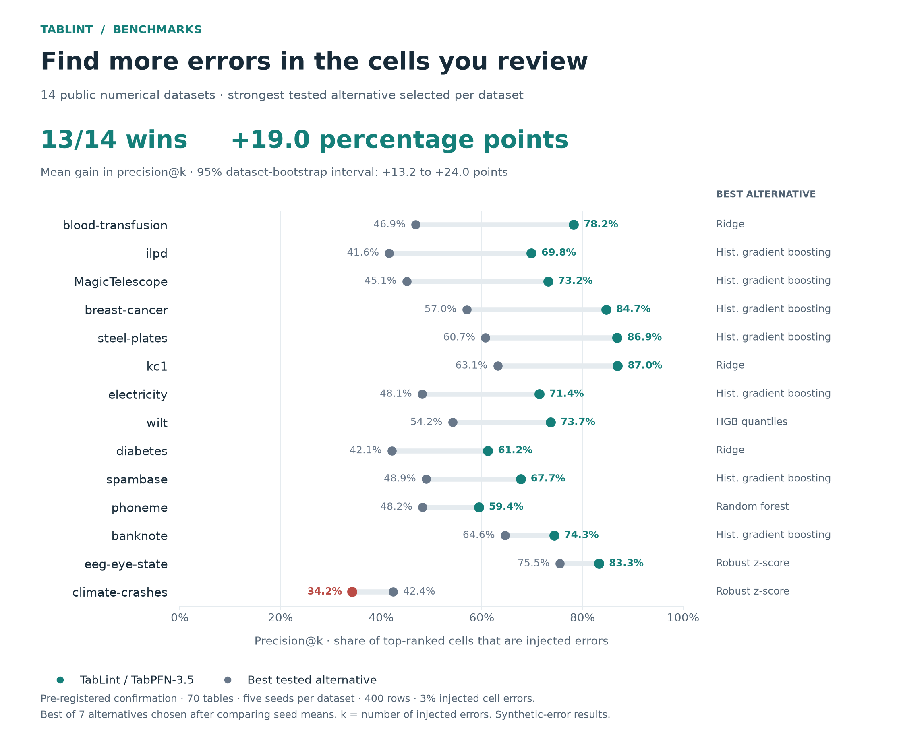
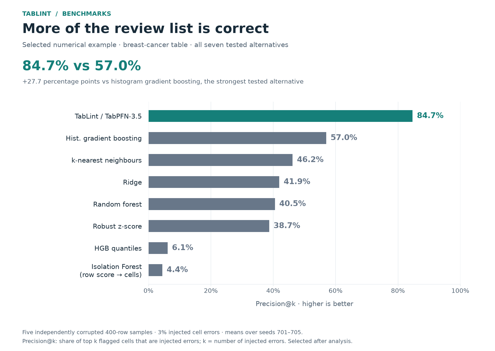
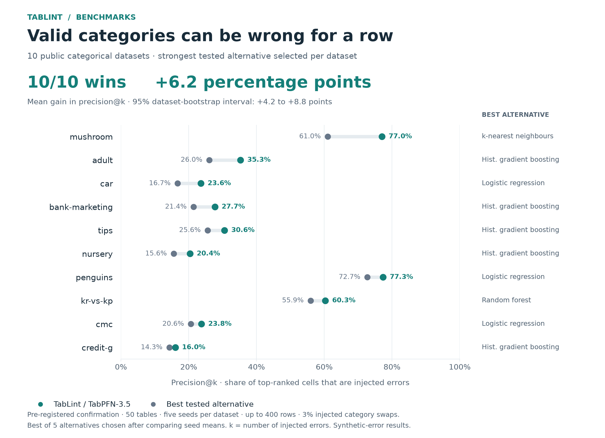
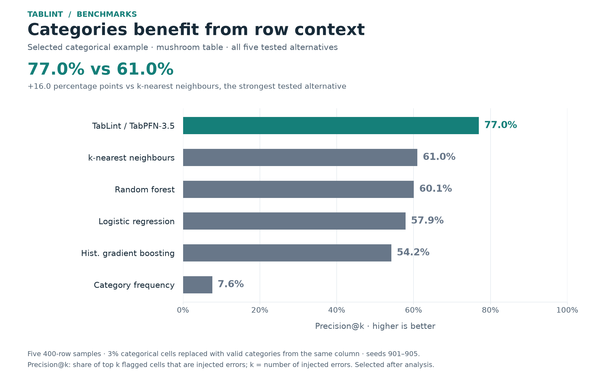
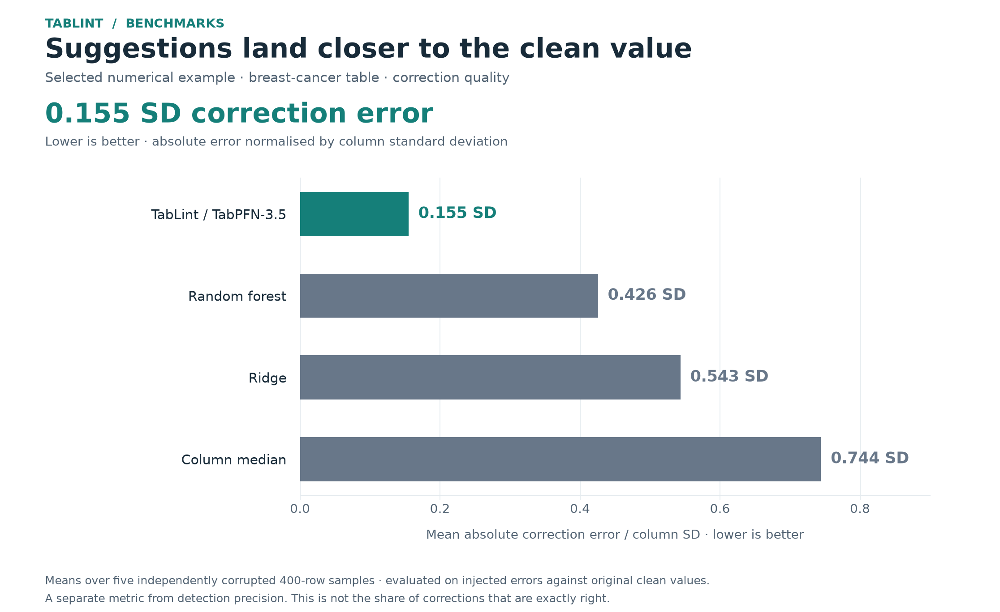
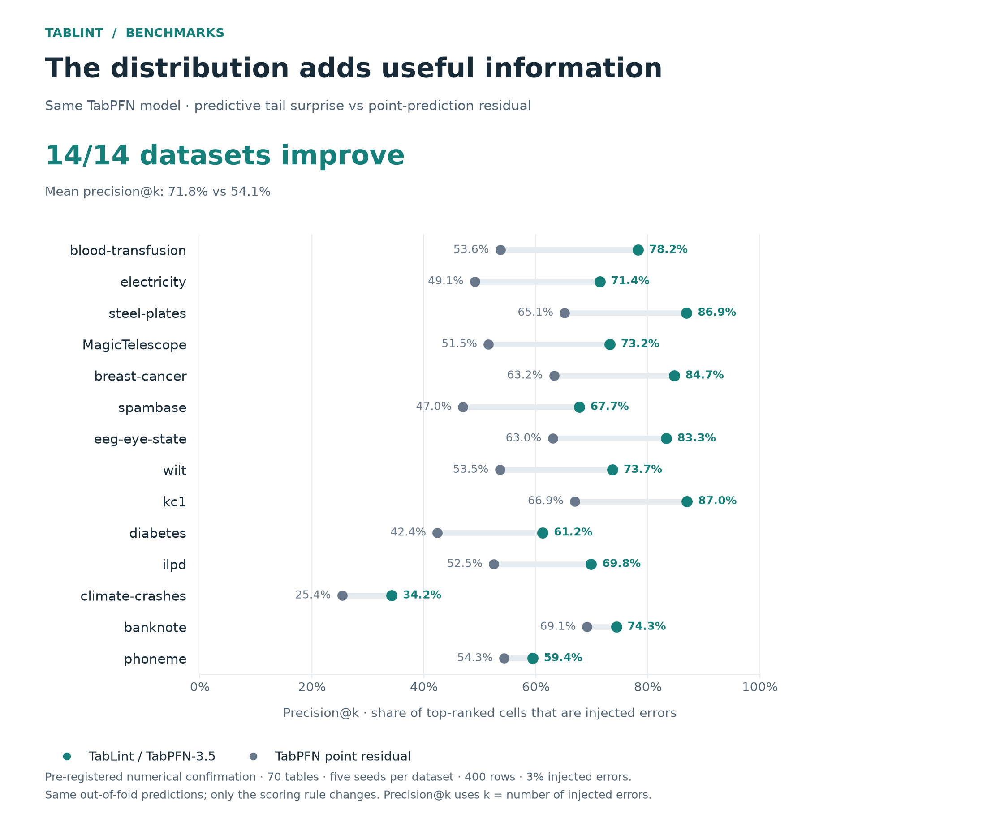

# How well does TabLint find table errors?

TabLint uses TabPFN-3.5 to rank cells that look inconsistent with the rest of their row. In two pre-registered confirmation experiments, it outperformed the strongest tested alternative on **13/14 numerical datasets** and **10/10 categorical datasets**.

| Confirmation experiment | Dataset wins | Mean gain in precision@k | 95% bootstrap interval | Tables |
| --- | ---: | ---: | ---: | ---: |
| Numerical cells | 13 / 14 | +19.0 percentage points | +13.2 to +24.0 points | 70 |
| Categorical cells | 10 / 10 | +6.2 percentage points | +4.2 to +8.8 points | 50 |

**Precision@k** is the fraction of the top k flagged cells that are injected errors; k is the number of injected errors in that table. It measures the quality of a ranked review list. It is not ordinary classification accuracy or the precision of the product's default threshold. Dataset results average five seeds; the headline gains give each dataset equal weight.

[Numerical comparison](#numerical-cells-all-14-datasets) · [Featured numerical example](#featured-numerical-example) · [Categorical comparison](#categorical-cells-all-10-datasets) · [Suggested fixes](#how-close-are-the-suggested-fixes) · [Why TabPFNs distribution matters](#why-tabpfns-distribution-matters) · [Reproduce the figures](#reproduce-the-figures)

## Numerical cells: all 14 datasets



All 14 datasets are shown. For each dataset, the comparator is the best of seven tested methods, selected after averaging their results across seeds: robust z-score, Isolation Forest, ridge, k-nearest neighbours, random forest, histogram gradient boosting, and histogram gradient boosting quantiles. The one-sided Wilcoxon signed-rank p-value is **0.00018**.

The exception is **climate-crashes**: TabLint scores **34.2%** versus **42.4%** for robust z-score. These independently sampled simulation parameters offer little cross-column structure, so predicting a cell from its row is less useful.

[Vector figure](figures/tablint_benchmark_numerical.svg) · [Complete numerical results](PROOFREAD_RESULTS.md) · [Registered protocol](PROOFREAD_PREREG.md)

## Featured numerical example

On the **breast-cancer table**, precision@k is **84.7%** for TabLint versus **57.0%** for histogram gradient boosting, the strongest tested alternative: a **27.7 percentage-point improvement**.



This example was selected after analysis because it combines high detection precision, a large gain, and useful correction estimates. It is a benchmark of corrupted table cells, not diagnostic performance. The five seed means come from independently corrupted 400-row samples. Isolation Forest's row score is broadcast to cells; it is not a native cell-localisation method.

For context, **blood-transfusion** has the largest numerical gain (+31.3 points), while **kc1** has the highest numerical precision (87.0%). The complete comparison above avoids presenting one selected success as the typical result.

[Vector figure](figures/tablint_benchmark_numerical_spotlight.svg) · [Raw example run, seed 701](../results/proofread/breast-cancer_701.json)

## Categorical cells: all 10 datasets

TabLint also checks values that are valid categories for a column but surprising for their row. In the categorical confirmation, it wins on **10/10 datasets**, averaging **+6.2 percentage points** over the strongest tested alternative per dataset. The one-sided Wilcoxon p-value is **0.00098**.



Comparators are category frequency, logistic regression, random forest, k-nearest neighbours, and histogram gradient boosting. Each dataset's best comparator is selected after averaging its five seeds. The samples contain up to 400 rows: penguins has 344 and tips has 244.

[Vector figure](figures/tablint_benchmark_categorical.svg) · [Complete categorical results](CATEGORICAL_RESULTS.md) · [Registered protocol](CATEGORICAL_PREREG.md)

### Featured categorical example

**Mushroom** has the largest categorical gain: **77.0%** versus **61.0%** for k-nearest neighbours, a **16.0 percentage-point improvement**. The graph includes all five tested alternatives rather than comparing only with frequency scoring.



Corruptions replace a value with another valid category from the same column. This tests row consistency, not spelling. A replacement that also fits the rest of the row may be undetectable. The separate typo hint is not evaluated here. Auto MPG was used during development and is excluded from this confirmation experiment.

[Vector figure](figures/tablint_benchmark_categorical_spotlight.svg) · [Raw example run, seed 901](../results/categorical/mushroom_901.json)

## How close are the suggested fixes?

Finding the right cells is one task; proposing useful replacements is another. On the selected breast-cancer example, TabPFN's median prediction has mean absolute correction error **0.155 column standard deviations**, compared with **0.426** for random forest, **0.543** for ridge, and **0.744** for the column median.



This averages the absolute distance from the original clean value on injected errors, normalised by column standard deviation, across five seeds. Lower is better. It does not measure the fraction of fixes that are exactly correct; suggestions still need review.

[Vector figure](figures/tablint_benchmark_corrections.svg) · [All-dataset correction results](PROOFREAD_RESULTS.md#h6-cell-errors-3-of-cells-corrupted-5-error-types)

## Why TabPFN's distribution matters

TabLint scores the recorded value against TabPFN's predictive distribution. Using its tail-surprise score beats a score based on the same model's point-prediction residual on **14/14 numerical datasets**: mean precision@k **71.8% versus 54.1%**.



This comparison changes the scoring rule while keeping the TabPFN predictions fixed. It isolates the contribution of distribution-based scoring; it is not a comparison with a different model or model version.

[Vector figure](figures/tablint_benchmark_distribution.svg) · [Scoring implementation](../proofread/core.py)

## What these results do—and do not—show

The numerical protocol uses 400-row samples, five fresh seeds per dataset and 3% injected errors: decimal slips, row-value swaps, offsets, zeros, and digit transpositions. Each numerical column is predicted out of fold from the other columns plus the label. The categorical protocol uses five fresh seeds, up to 400 rows per sample and 3% same-column category swaps, with no designated label column. Both protocols were written before their confirmation runs.

The figures compare the implemented benchmark configurations, including the strongest measured alternative for each dataset. They do not establish superiority to every possible tuned model, every data-quality tool, or every TabPFN version. They measure synthetic corruptions on public tables; product demonstrations with saved results are not additional benchmarks. The headline bootstrap intervals resample dataset-level differences after averaging seeds, not individual cells.

Precision@k assumes a review budget equal to the known number of injected errors. At the separately analysed numerical threshold of 2 used by the product, pooled precision is **87.9%** and recall is **53.3%** on the same confirmation tables. This is a different operating point, and should not replace precision@k in the model comparison.

Independent columns, high-cardinality identifiers and free text are limitations of this approach. [Full research overview](RESEARCH_OVERVIEW.md#limitations) · [Model-version comparison](VERSION_COMPARISON.md) · [Pre-registrations](PREREGISTRATIONS.md)

## Reproduce the figures

From the repository root, run:

```bash
uv run --with matplotlib==3.11.2 python benchmarks/make_showcase_figures.py
```

This renders saved results without model inference. The renderer verifies all **70 numerical and 50 categorical runs**, their datasets and seeds, and the selected baselines against the published summaries. It writes six PNG/SVG pairs and a [CSV of all 94 plotted means](figures/tablint_benchmark_values.csv). The CSV retains full-precision values and the sample size for each dataset; displayed percentages round to one decimal place. An alternative output directory can be supplied with `--out`.

[Renderer](../benchmarks/make_showcase_figures.py) · [Numerical summary](../results/proofread/summary.json) · [Categorical summary](../results/categorical/summary.json) · [Numerical analysis](../benchmarks/summarize_proofread.py) · [Categorical analysis](../benchmarks/summarize_categorical.py)
