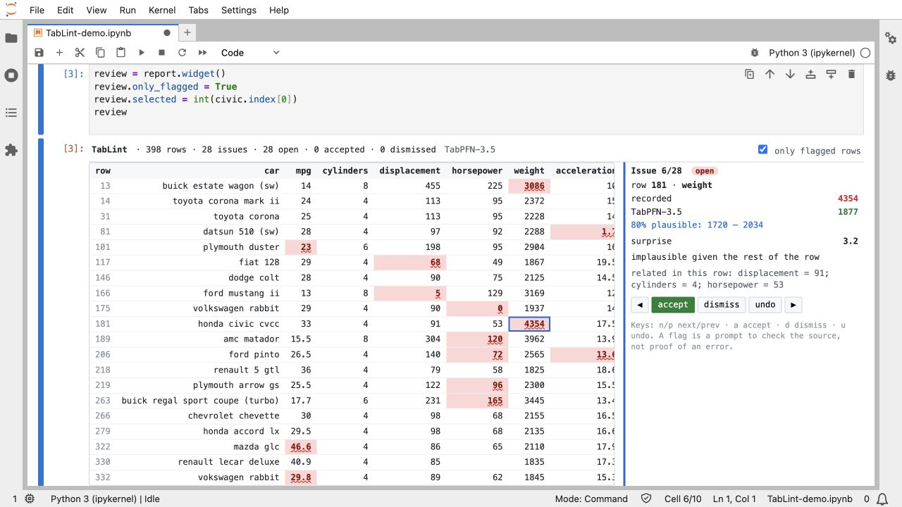
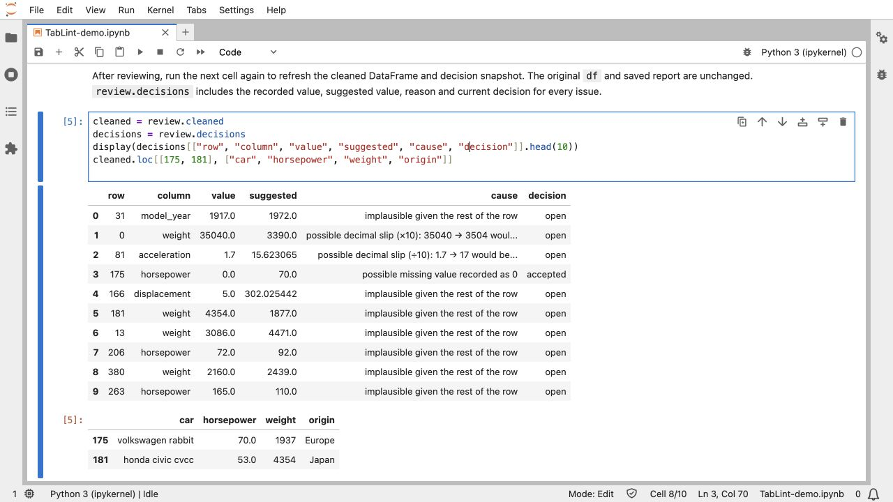
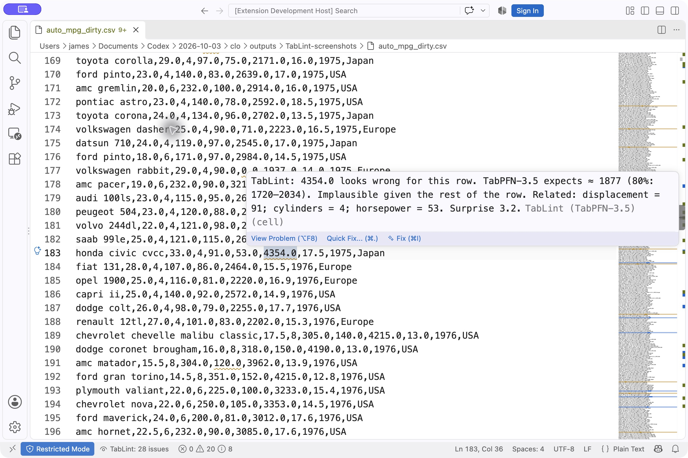
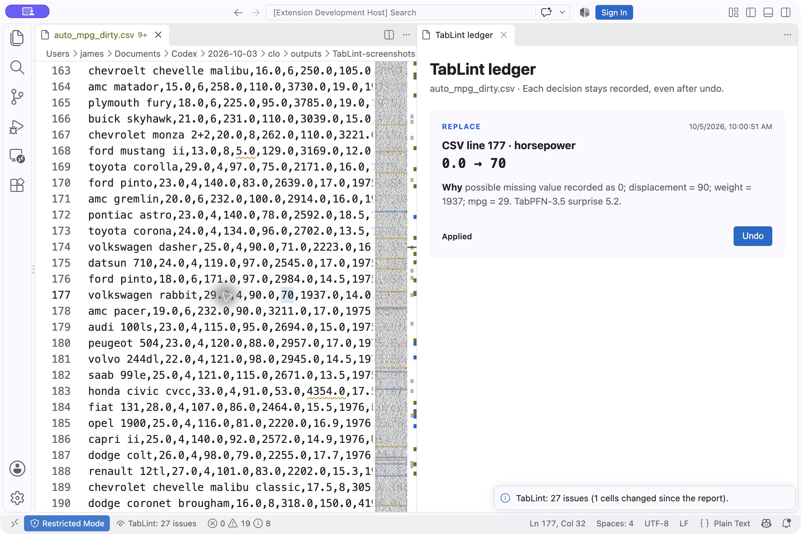

# Getting started with TabLint

## Jupyter notebooks

### Install in your existing notebook

Use a **Python 3.12** kernel and have Git installed. In your notebook, install from GitHub:

```python
%pip install "tabpfn-proofread[notebook] @ git+https://github.com/James-Begin/TabLint.git"
```

Restart the kernel after installation. `%pip` installs into the active notebook kernel's environment. The project includes the Python library, interactive widget and JupyterLab.

From a terminal using the same Python environment, the equivalent is:

```sh
python -m pip install "tabpfn-proofread[notebook] @ git+https://github.com/James-Begin/TabLint.git"
```

### Create a new notebook environment

Install [uv](https://docs.astral.sh/uv/getting-started/installation/), then:

```sh
git clone https://github.com/James-Begin/TabLint.git && cd TabLint && uv run --extra notebook jupyter lab
```

`uv` prepares Python 3.12 and the locked dependencies. JupyterLab opens in your browser. Create a **Python 3 (ipykernel)** notebook. This opens a notebook environment for your own work; it does not run analysis automatically.

For headless use: `uv run --extra notebook jupyter lab --no-browser --port 8888`. Follow the local URL printed by Jupyter and stop the server with Ctrl+C. [JupyterLab startup](https://jupyterlab.readthedocs.io/en/stable/getting_started/starting.html) · [uv's notebook guide](https://docs.astral.sh/uv/guides/integration/jupyter/)

### Check your DataFrame

```python
import pandas as pd
import proofread

df = pd.read_csv("data.csv")  # use the path to your own CSV
review = df.tablint.view(categorical=True)
review
```

Click highlighted cells for the expected value, uncertainty, likely cause and related columns. **Accept** applies a suggestion to a cleaned copy, **dismiss** leaves the source value unchanged, and **undo** reverses the last widget decision. Keyboard shortcuts after clicking the widget: `n` / `p` next / previous, `a` accept, `d` dismiss, `u` undo.

Numeric cells use TabPFN's predictive distribution. Low-cardinality categorical cells use its classifier probabilities and show likely alternatives. High-cardinality strings and declared categories are retained as model context, using sorted categorical codes. They are not automatically checked as category targets. These codes identify distinct strings; they are not semantic text embeddings. Declare numerical IDs before checking: `df["customer_id"] = df["customer_id"].astype("category")`. Add `label="outcome"` to check a known target column.

To inspect the report before opening the widget:

```python
report = df.tablint.check(categorical=True)
report.issues
report.highlight()
review = report.widget()
review
```



*Actual JupyterLab screenshot using Auto MPG data and saved TabPFN results. The setup above checks your own DataFrame.*

### Export your results

After making decisions, run another cell:

```python
cleaned = review.cleaned
changes = review.decisions
cleaned.to_csv("cleaned.csv", index=False)
changes.to_csv("decisions.csv", index=False)
```

Rerun this cell after further review to refresh the exported results. The original DataFrame stays intact. Decisions contain recorded and suggested values, model reasons and the current review state. They are a snapshot; undo history lasts for the widget session. The optional VS Code integration separately has a persistent ledger with timestamps and flag-for-review actions.



*After accepting the Rabbit’s 0.0 → 70 horsepower suggestion, the cleaned DataFrame and decision snapshot reflect the review.*

The original `df.proofread` accessor remains supported. `%load_ext proofread` registers both `%tablint df` and the original `%proofread df` magic.

## Model setup

First inference downloads TabPFN weights and may open the upstream model-license acceptance flow. Complete that flow if you agree to the model terms. Weights are cached separately and are not redistributed with TabLint. A GPU is optional; CPU inference can take several minutes.

Pass `fast=True` to use TabPFN-3.5-Fast, `threshold=3` to raise the numerical flag threshold, or `categorical=False` to skip categorical-column checks. A flag is a prompt to verify the source record, not a confirmed error.

## VS Code

Jupyter is the primary workflow; the editor integration is optional.

### Prepare the Python engine

Install [uv](https://docs.astral.sh/uv/getting-started/installation/) and [VS Code](https://code.visualstudio.com/) 1.90+. If you already followed the new notebook environment setup, use that checkout. Otherwise:

```sh
git clone https://github.com/James-Begin/TabLint.git && cd TabLint && uv sync
```

### Install the extension

Download the [built TabLint extension](../demo/showcase/tablint.vsix). In VS Code, open the Command Palette (`Ctrl+Shift+P` / `Cmd+Shift+P`), run **Extensions: Install from VSIX…** and select the downloaded file.

To build from source instead, install Node.js 22+ and npm, then run from the checkout:

```sh
npm --prefix vscode-proofread ci
mkdir -p dist
npm --prefix vscode-proofread run package
```

Install `dist/tablint.vsix` with the same **Install from VSIX…** command.

### Connect the engine and check your CSV

Open your data folder in VS Code. In Settings, search for `proofread.command` (**Proofread: Command**) and set it to the command for your TabLint checkout:

```json
{
  "proofread.command": "uv run --project /absolute/path/to/TabLint tablint"
}
```

For a path containing spaces, quote it inside the setting: `uv run --project \"/path/to/My Project/TabLint\" tablint` in Settings JSON. Opening the TabLint repository itself as your workspace uses the default `uv run proofread` command without extra configuration. An absolute installed CLI executable also works.

Open your CSV and run **TabLint: Check this CSV with TabPFN-3.5** from the Command Palette. Choose **(no label column)** unless you also want to check a known target column. The engine analyzes the file and writes a report beside it. Model setup is the same as for Jupyter.



*Actual VS Code screenshot using saved Auto MPG inference results. A squiggle marks the flagged value; the hover explains what TabPFN expects and why.*

Hover flagged cells and use Quick Fix (`Ctrl+.` / `Cmd+.`) to replace, flag for source review or dismiss a suggestion. When flagging, enter an optional review note. Open the **Problems** panel for a list of flagged cells.

### Review the decision ledger

Run **TabLint: Open decision ledger** while your CSV is active. The ledger stores the before/after values, model reason, timestamp and review note. **Undo** reverses a decision; a replacement is restored only if the cell still contains the value TabLint wrote, protecting newer manual edits. Save the CSV after applying fixes.



*The Rabbit’s horsepower fix is recorded once, with its model reason and an Undo button. This screenshot was captured after using the extension’s Quick Fix action.*

[Extension settings](../vscode-proofread/README.md#settings)

## Terminal

From the cloned checkout:

```sh
uv run tablint check data.csv --out reports/data
uv run tablint view reports/data.json
```

The check writes JSON, Markdown, highlighted HTML and an issues CSV. The terminal viewer supports `n` / `p` next / previous, `a` accept, `d` dismiss, `u` undo, `f` flagged rows, and `s` save a cleaned CSV and decisions JSON.

## Browser viewer

```sh
uv run --extra demo tablint app
```

Upload your CSV and press **Check with TabLint**. This performs a live check and needs the model weights. The browser integration runs from `proofread/browser.py`, which is included in the installed Python package.

## Troubleshooting

| Symptom | Next step |
| --- | --- |
| Python version mismatch | Select a Python 3.12 kernel, or use the `uv` setup command to prepare that interpreter. |
| Git is missing during installation | Install Git, or clone/download the repository and run `python -m pip install -e ".[notebook]"` from its root. |
| Widget is blank or `anywidget` cannot be imported | Install in the active kernel's environment, restart the kernel, and rerun the widget cell. |
| `proofread` cannot be imported | Confirm the selected kernel is the environment where you installed TabLint. |
| Port 8888 is busy | Jupyter normally chooses the next free port; follow the printed URL or pass `--port 8890`. |
| Model access/download error | Complete the upstream model-license flow and check network access. |
| Slow analysis | Use a CUDA GPU or try `fast=True`. More columns and folds increase inference work. |
| VS Code shows no diagnostics | Check the CLI path, run the CSV analysis command, and inspect its output. Modified cells intentionally stop showing stale diagnostics. |

[Back to the README](../README.md)
