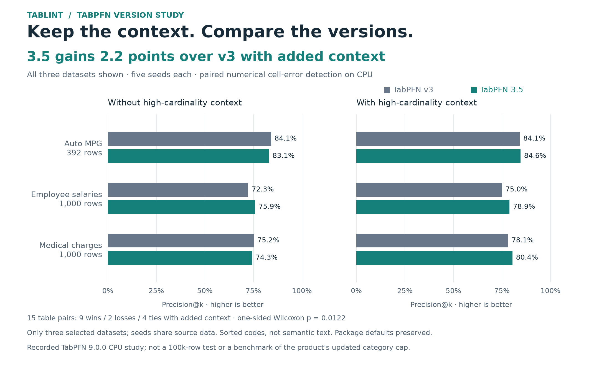

# Does retaining high-cardinality context help TabPFN-3.5?

In this supplied CPU experiment, **TabPFN-3.5 reaches 81.3% precision@k versus 79.1% for v3** when the added identity/context columns are included: **+2.2 percentage points**. The comparison includes all three selected datasets, five seeds each, and both context arms. It is separate from the earlier 12-dataset numerical suite.



[Vector figure](figures/tablint_benchmark_high_cardinality.svg) · [All 15 original run files](../results/high_cardinality/) · [Full-precision values](../results/high_cardinality/values.csv) · [Computed summary](../results/high_cardinality/summary.json)

## Results

Precision@k is the share of the top k ranked cells that are injected errors, where k equals the actual error count. Each row below averages five seeds; the overall mean weights the three datasets equally.

| Dataset | Rows after filtering | v3 without added context | 3.5 without added context | v3 with added context | 3.5 with added context |
| --- | ---: | ---: | ---: | ---: | ---: |
| Auto MPG | 392 | 84.1% | 83.1% | 84.1% | 84.6% |
| Employee salaries | 1,000 | 72.3% | 75.9% | 75.0% | 78.9% |
| Medical charges | 1,000 | 75.2% | 74.3% | 78.1% | 80.4% |
| **Mean** | | **77.2%** | **77.7%** | **79.1%** | **81.3%** |

Employee salaries has the largest version gain with added context, **+3.9 points**. Medical charges illustrates the context benefit: adding provider and diagnosis identities improves 3.5 from **74.3% to 80.4%**, **+6.1 points**, versus **+2.9 points** for v3. These examples are selected after analysis; the figure shows every dataset and both arms.

| Supplied hypothesis | Mean paired gain | Wins / losses / ties | One-sided Wilcoxon p |
| --- | ---: | ---: | ---: |
| H1: 3.5 − v3 with added context | +2.19 points | 9 / 2 / 4 | 0.0122 |
| H2: (3.5 with − without) − (v3 with − without) | +1.66 points | 10 / 3 / 2 | 0.0287 |
| Without added context: 3.5 − v3 (descriptive) | +0.53 points | 7 / 6 / 2 | 0.3242 |

The supplied protocol specifies H1 at α = 0.05 and H2 as a second hypothesis; these are unadjusted tests over **15 dataset/seed pairs** after removing zero differences. Repeated seeds share source datasets, so they are **not 15 independent datasets**. The p-values describe this selected study and are not broad evidence of superiority across arbitrary tables. No run or seed was discarded.

AUROC is secondary: with added context, its mean is **0.9869 for 3.5 versus 0.9818 for v3**, with 13 wins and two losses. All per-error-type AUROCs are retained in the raw JSONs. Mean CPU time per table/model/context arm is **156 seconds for 3.5 versus 80 seconds for v3** with added context; each arm checks every numerical target across five folds. The uploaded handoff identifies an Apple M4 Pro with four PyTorch threads; timings include model creation per fit and are descriptive rather than a controlled speed benchmark.

## Methods

The [supplied protocol](../benchmarks/high_cardinality_protocol/PROTOCOL.md) and [environment pins](../benchmarks/high_cardinality_protocol/requirements.txt) are preserved unchanged. Its input row count for Auto MPG refers to the 398-row source; the runner drops six rows with missing numerical targets, leaving the 392 rows recorded in every result. Its source-wide cardinalities differ from those in the actual samples.

| Dataset / source | Numerical targets | Existing low-cardinality context | Added context; observed distinct values across samples |
| --- | --- | --- | --- |
| Employee salaries / OpenML 42125 | Annual salary, gross pay, overtime pay, year hired | Gender, assignment category | Position title 155–167; division 272–278; department 23–25 |
| Medical charges / OpenML 42720 | Discharges, covered charges, total payments, Medicare payments | None | Diagnosis group 100; provider state 49–50; hospital referral region 247–264; provider ID 800–831 |
| Auto MPG / repository CSV | MPG, displacement, horsepower, weight, acceleration | Cylinders, model year, origin | Car identity 301 |

1. Drop rows missing any numerical target; sample up to 1,000 rows without replacement using the seed. Use all complete Auto MPG rows.
2. Reuse the original [`inject()`](../benchmarks/proofread_confirm.py) unchanged: nominate 3% of numerical cells for decimal slips, same-column row swaps, offsets, zeros or digit transpositions. Swaps that change a value too little are skipped, so the final error count is below 3%; k uses the actual count.
3. Encode context by **lexically sorted string value codes**, preserving missing values as NaN. The two arms share exactly the same sampled rows, corruptions, folds and numerical targets. `num` includes other corrupted numerical columns plus existing low-cardinality context; `hc` adds the specified identities. Department is included in that added bundle even though these samples have fewer than 30 levels.
4. Fit local TabPFN v3 and 3.5 regressors with their 9.0.0 version defaults, CPU, fixed random state and `ignore_pretraining_limits=True`. Both receive categorical feature indices for the encoded context. Hold each checked row out of its five-fold training context; other training cells may also contain injected corruptions.
5. Rank numerical cells by **−ln(2 min(F, 1−F))**, clipping F to [10⁻⁹, 1−10⁻⁹]. Use stable sorting for ties. The product uses a base-10 score and a different clipping bound; this runner preserves the study's scoring configuration.

Seeds 1001–1005 give **15 paired tables and 60 model/context arm records**, involving 1,300 column/fold fits. The Auto MPG pilot at seed 999 is outside this specified analysis.

## Important preprocessing distinction

The experiment supplies float codes and categorical feature indices, but does **not** raise TabPFN's numeric-code category cap. [TabPFN 9.0.0 modality detection](https://github.com/PriorLabs/TabPFN/blob/v9.0.0/src/tabpfn/preprocessing/modality_detection.py) keeps declared **numeric** codes categorical only within its default 30-value cap; larger vocabularies can be inferred as numerical. The upload does not record fitted feature schemas. These results demonstrate the benefit of **retaining the supplied coded context**, not an isolated test of native high-cardinality categorical treatment.

The updated [product engine](../proofread/core.py) retains all string/object, boolean and declared categorical inputs, uses sorted identity codes, supplies categorical indices, and raises the cap to at least the table row count. An actual CPU regression/classification test checks the fitted feature schemas. This product change is **not the exact configuration measured in the upload**, so its performance is not inferred from the new table. Reproduction deliberately keeps the older defaults.

Neither configuration embeds free text semantically. This study does not test free-text understanding, 100k-row contexts, high-cardinality categorical **targets**, Fast, or alternative non-TabPFN baselines. The [retail capability pilot](RETAIL_CPU_BENCHMARK.md) remains separate; its larger-context attempts do not supply a completed 100k-row quality result.

## Reproduce and provenance

Rebuild the summary and PNG/SVG from the original saved measurements without inference:

```sh
uv run --with matplotlib==3.11.2 python -m benchmarks.summarize_high_cardinality
```

For fresh inference, use an isolated Python 3.12 environment with the supplied **TabPFN 9.0.0** pins; the product uses 9.1.0. Model access and OpenML downloads are required. Start with one table, then run all 15 in a new directory:

```sh
OMP_NUM_THREADS=4 uv run --no-project --python 3.12 \
  --with-requirements benchmarks/high_cardinality_protocol/requirements.txt \
  python -m benchmarks.high_cardinality --datasets auto_mpg --seeds 1001 \
  --out results/reproduction/high_cardinality_smoke

OMP_NUM_THREADS=4 uv run --no-project --python 3.12 \
  --with-requirements benchmarks/high_cardinality_protocol/requirements.txt \
  python -m benchmarks.high_cardinality --out results/reproduction/high_cardinality

uv run --with matplotlib==3.11.2 python -m benchmarks.summarize_high_cardinality \
  --root results/reproduction/high_cardinality --figure-dir results/reproduction/high_cardinality/figures
```

The [portable runner](../benchmarks/high_cardinality.py) removes machine-specific paths and dynamic source execution while preserving the experiment's policies. It checks package versions, records sample and runner hashes for new reproductions, refuses mixed configurations, and skips completed files. CPU results can vary across machines and package/hardware configurations.

The [provenance manifest](../benchmarks/high_cardinality_protocol/provenance.json) records the uploaded archive, protocol, original runner and all 15 raw-result SHA-256 checksums. Raw results and the protocol are copied byte-for-byte; the summarizer verifies the full frozen inventory and independently recomputes the supplied analysis. The protocol describes itself as written before the runs, but the archive does not provide an independently timestamped preregistration. Original sample hashes, checkpoint hashes and fitted schemas were not supplied. The original archive is preserved locally outside the submission tree; its stale handoff notes and pilot are not benchmark evidence.
