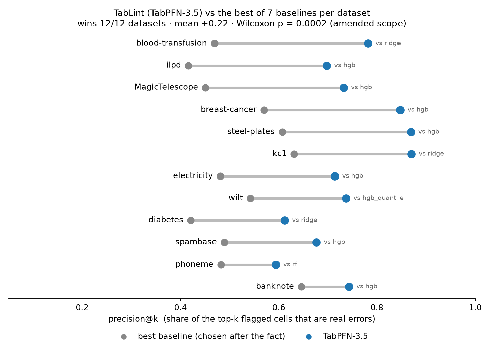
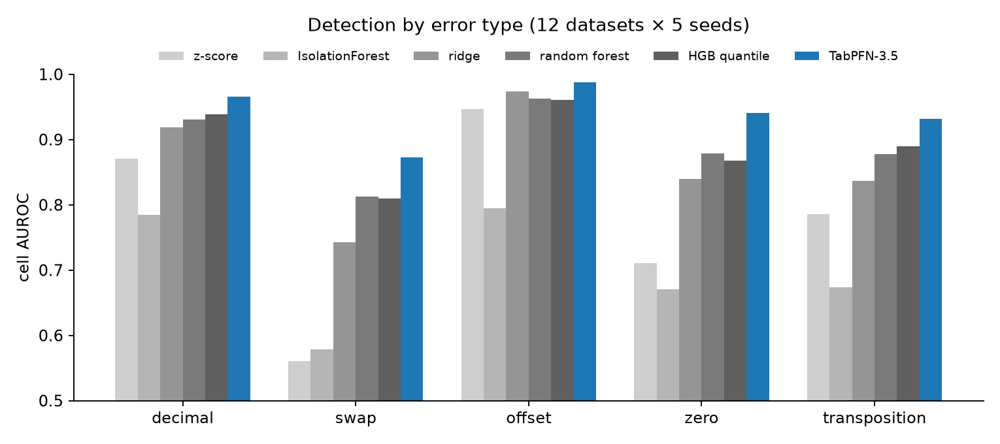

# TabLint: numerical and label results

12 retained public datasets × five seeds (701–705), 400-row tables, 60 runs. Two dataset executions were excluded after the author reported test errors. [Amendment and provenance](BENCHMARK_AMENDMENT.md) · [Scoring implementation](../benchmarks/proofread_confirm.py).

The hypotheses and scoring rules were specified before running; the retained scope was amended after analysis. All retained datasets are reported. Statistics are conditional on that scope.

## Headline

**Cells (H6):** TabPFN-3.5 beats the best of 7 baselines (chosen per dataset, after the fact) on **12/12 datasets**; mean precision@k gain +0.222 [+0.184, +0.258], one-sided Wilcoxon p = 0.00024 — supported.

**Labels (H7):** TabPFN-3.5 beats the best of 4 baselines on **11/12**; mean AUROC gain +0.014 [+0.006, +0.023], p = 0.0034 — supported.

## H6: cell errors (3% of cells corrupted; 5 error types)

Precision@k is the share of the top k flagged cells that are injected errors, where k is the number injected. The comparator is the strongest measured method per dataset, chosen after averaging seeds: robust z-score, Isolation Forest, ridge, kNN, random forest, HGB or HGB quantiles. Fix error is mean absolute distance from the original clean value, in column standard deviations.

| Dataset | TabPFN-3.5 | Best baseline | Baseline | Δ | TabPFN AUROC | Best baseline AUROC | Fix error TabPFN | RF | ridge | column median |
|---|---:|---|---:|---:|---:|---:|---:|---:|---:|---:|
| MagicTelescope | 0.73 | hgb | 0.45 | +0.28 | 0.925 | 0.910 | 0.40 | 0.53 | 0.56 | 0.76 |
| banknote | 0.74 | hgb | 0.65 | +0.10 | 0.962 | 0.962 | 0.23 | 0.35 | 0.53 | 0.85 |
| blood-transfusion | 0.78 | ridge | 0.47 | +0.31 | 0.984 | 0.937 | 0.26 | 0.43 | 0.45 | 0.73 |
| breast-cancer | 0.85 | hgb | 0.57 | +0.28 | 0.992 | 0.954 | 0.16 | 0.43 | 0.54 | 0.74 |
| diabetes | 0.61 | ridge | 0.42 | +0.19 | 0.910 | 0.887 | 0.62 | 0.70 | 0.77 | 0.77 |
| electricity | 0.71 | hgb | 0.48 | +0.23 | 0.955 | 0.932 | 0.36 | 0.56 | 0.83 | 0.76 |
| ilpd | 0.70 | hgb | 0.42 | +0.28 | 0.962 | 0.930 | 0.26 | 0.47 | 0.55 | 0.60 |
| kc1 | 0.87 | ridge | 0.63 | +0.24 | 0.993 | 0.972 | 0.07 | 0.22 | 0.31 | 0.54 |
| phoneme | 0.59 | rf | 0.48 | +0.11 | 0.877 | 0.870 | 0.45 | 0.53 | 0.74 | 0.78 |
| spambase | 0.68 | hgb | 0.49 | +0.19 | 0.975 | 0.953 | 0.21 | 0.38 | 0.55 | 0.30 |
| steel-plates | 0.87 | hgb | 0.61 | +0.26 | 0.996 | 0.960 | 0.07 | 0.30 | 0.51 | 0.71 |
| wilt | 0.74 | hgb_quantile | 0.54 | +0.20 | 0.957 | 0.939 | 0.42 | 0.62 | 0.69 | 0.65 |

**Distribution ablation:** predictive tail surprise beats the same TabPFN model’s point residual on 12/12 datasets; mean precision@k 73.9% vs 55.7%.

| Error type | zscore | iforest | ridge | knn | rf | hgb | hgb_quantile | tabpfn_pit |
|---|---:|---:|---:|---:|---:|---:|---:|---:|
| decimal | 0.871 | 0.785 | 0.919 | 0.925 | 0.931 | 0.944 | 0.939 | 0.966 |
| swap | 0.561 | 0.579 | 0.743 | 0.772 | 0.813 | 0.805 | 0.810 | 0.873 |
| offset | 0.947 | 0.795 | 0.974 | 0.968 | 0.963 | 0.977 | 0.961 | 0.988 |
| zero | 0.711 | 0.671 | 0.840 | 0.857 | 0.879 | 0.892 | 0.868 | 0.941 |
| transposition | 0.786 | 0.674 | 0.837 | 0.860 | 0.878 | 0.881 | 0.890 | 0.932 |

## H7: label errors (10% of labels flipped uniformly)

| Dataset | TabPFN-3.5 AUROC | Best baseline | Baseline AUROC | Δ |
|---|---:|---|---:|---:|
| MagicTelescope | 0.918 | rf | 0.872 | +0.046 |
| banknote | 1.000 | knn | 0.998 | +0.002 |
| blood-transfusion | 0.855 | logistic | 0.851 | +0.004 |
| breast-cancer | 0.994 | logistic | 0.990 | +0.004 |
| diabetes | 0.843 | logistic | 0.848 | -0.005 |
| electricity | 0.856 | rf | 0.816 | +0.041 |
| ilpd | 0.804 | logistic | 0.785 | +0.019 |
| kc1 | 0.919 | logistic | 0.901 | +0.017 |
| phoneme | 0.906 | rf | 0.885 | +0.021 |
| spambase | 0.970 | rf | 0.953 | +0.017 |
| steel-plates | 1.000 | logistic | 0.999 | +0.001 |
| wilt | 0.994 | rf | 0.993 | +0.001 |

## Baseline and threshold addendum

[Addendum implementation](../benchmarks/proofread_addendum.py).

The same 60 corrupted tables were regenerated from their seeds. TabLint precision@k reproduces the numerical confirmation exactly (maximum absolute difference 0.0).

### A1. Prior Labs’ TabPFN outlier detector

Row AUROC: TabLint is higher on **12/12** datasets, mean gain +0.283, one-sided Wilcoxon p = 0.000244. Cell precision@k: higher on **12/12**.

| Dataset | TabLint precision@k | Outlier detector precision@k | TabLint row AUROC | Outlier detector row AUROC | Detector seconds |
|---|---:|---:|---:|---:|---:|
| MagicTelescope | 0.73 | 0.04 | 0.925 | 0.569 | 45 |
| banknote | 0.74 | 0.25 | 0.966 | 0.803 | 18 |
| blood-transfusion | 0.78 | 0.10 | 0.972 | 0.473 | 16 |
| breast-cancer | 0.85 | 0.03 | 0.968 | 0.379 | 145 |
| diabetes | 0.61 | 0.06 | 0.859 | 0.609 | 38 |
| electricity | 0.71 | 0.12 | 0.936 | 0.649 | 31 |
| ilpd | 0.70 | 0.05 | 0.948 | 0.724 | 44 |
| kc1 | 0.87 | 0.03 | 0.983 | 0.727 | 96 |
| phoneme | 0.59 | 0.20 | 0.874 | 0.746 | 23 |
| spambase | 0.68 | 0.03 | 0.831 | 0.547 | 297 |
| steel-plates | 0.87 | 0.06 | 0.987 | 0.711 | 112 |
| wilt | 0.74 | 0.13 | 0.951 | 0.863 | 23 |

The optional `tabpfn-extensions` detector uses ten feature permutations and fits/scores the same table. Its row score is broadcast to cells. It required a float64 compatibility workaround on CUDA; [the bug report](bugs/TABPFN_EXTENSIONS_CUDA_DTYPE.md) records its effect and limitations. This compares the tested configurations on cell-error detection, not overall anomaly-detector quality.

### A2. Operating point shown to users

| Threshold (−log₁₀ tail probability) | Precision | Recall | Cells listed (60 tables) |
|---|---:|---:|---:|
| 2 | 87.3% | 56.8% | 6434 |
| 3 | 94.4% | 20.3% | 2129 |

Threshold 2 is the product default. This operating point differs from precision@k and was selected after the original threshold analysis.

## Real-data context and limitations

The stored [Pima report](../results/proofread_demos/pima_real.json) illustrates known impossible zeros and placeholder patterns. The [familiar-dataset gallery](FAMOUS_DATASETS.md) separates verified, unusual and unverified findings, including missed known errors.

- Corruptions are synthetic; real-world error mixes and relationships differ.
- These numerical experiments check continuous columns with more than ten distinct values. [Categorical checks](CATEGORICAL_RESULTS.md) are a separate experiment.
- Each checked column costs five out-of-fold TabPFN fits; inference cost grows with table width.
- Flags require source review. Predictive surprise is not a calibrated probability that a value is wrong.

Generated from stored artifacts by `benchmarks/make_proofread_results.py`; no new inference is performed.
