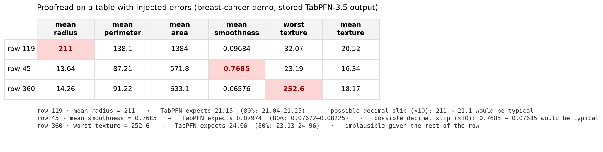
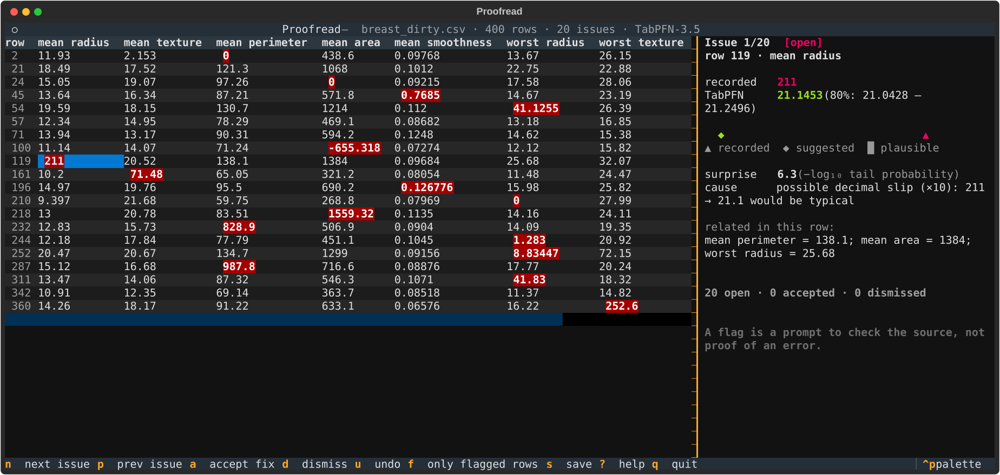
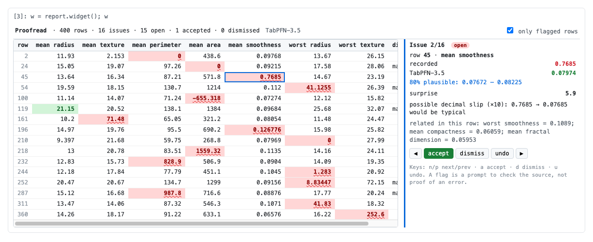

# TabLint — research overview

**Spellcheck for tables, powered by TabPFN-3.5.**

TabLint reads a table the way a careful analyst would. For every cell it asks, "given the rest of this row, is this
value plausible?", then underlines the ones that aren't and suggests what was probably meant:

```text
row 119  mean radius = 211.0     TabPFN expects ≈ 21.1   → possible decimal slip (×10): 211 → 21.1
row 351  fDist       = 912.3     TabPFN expects ≈ 196    → possible swapped leading digits: 912.3 → 192.3
row 9    bmi         = 0.0       TabPFN expects ≈ 33.8   → possible missing value recorded as 0
row 197  diabetes    = positive  TabPFN gives it 1.1%    → check this label
```



A per-column check (z-score, range rules) only catches values that are extreme for the column. TabLint catches
values that look normal on their own but are **impossible for this row**: a value pasted from the wrong record, a
slipped decimal in a feature that varies a lot, a 0 standing in for "missing".


## Results (pre-registered, all datasets reported)

Design and decision rules were written down before the confirmation run (`PROOFREAD_PREREG.md`; all pre-registrations and their hashes are listed in `PREREGISTRATIONS.md`). The test set was
14 public tables, 5 fresh seeds each, with 3% of cells corrupted by five realistic error types and 10% of labels flipped.
TabPFN is compared against the **best of the baselines for each dataset, chosen after seeing the results**, which is
deliberately hard to beat. Full tables are in `PROOFREAD_RESULTS.md`.

| | Datasets won | Mean gain [95% CI] | One-sided Wilcoxon p |
|---|---:|---|---:|
| **Cell errors** (precision@k vs best of 7: z-score, IsolationForest, ridge, kNN, random forest, HGB, HGB-quantile) | **13 / 14** | **+0.19** [+0.13, +0.24] | 0.0002 |
| **Label errors** (AUROC vs best of 4: logistic, kNN, random forest, HGB) | **13 / 14** | +0.022 [+0.008, +0.041] | 0.0009 |
| **vs Prior Labs' TabPFN outlier detector** (`tabpfn-extensions`; row AUROC, its home turf) | **14 / 14** | +0.26 | 0.00006 |

- **What users see:** at the default threshold, **88% of listed cells are real errors**, and 53% of all errors get
  listed. `--threshold 3` gives 95% precision at 19% recall. This was a separately pre-registered addendum.
- **Cells, not just rows:** Prior Labs' own TabPFN outlier detector scores whole rows (full comparison in `COMPARISON_TABPFN_EXTENSIONS.md`). TabLint beats it at finding
  which rows contain errors on 14 of 14 datasets (AUROC +0.26 on average), and it also pinpoints the cell.
- **Precision@k:** of the k cells TabLint flags first (k = number of real errors), the share that really are errors.
  It is 0.59–0.87 for TabPFN-3.5 on 13 of the 14 datasets, against 0.42–0.76 for the best baseline.
- **Every error type:** TabPFN has the best detection AUROC for each one. The largest gap is on *swapped* values, which
  look ordinary for their column: 0.85 vs 0.79 for the best baseline and 0.56 for z-score
  (`figures/proofread_error_types.png`).
- **Suggested fixes:** they are closer to the true value than random-forest predictions on 13 of 14 datasets.
- **Where it doesn't help:** the one loss is a table of independently sampled simulation parameters (climate-crashes).
  With no relationship between columns, the rest of the row says nothing about a cell, and a per-column z-score wins.

**Categorical cells.** TabLint also checks low-cardinality categories against the rest of each row. In a separate
pre-registered test with plausible category swaps, it beat the best per-dataset baseline on 10 of 10 public tables
(mean precision@k gain +0.062). See `CATEGORICAL_RESULTS.md`; these numbers are separate from the numeric results above.
The new `VERSION_COMPARISON.md` compares four TabPFN checkpoints, and `FAMOUS_DATASETS.md` separates verified
findings from plausible and unverified flags on familiar public datasets.

**Real data, part 2.** On the untouched UCI Auto MPG table (398 cars), TabLint's #1 flag is a 1970 Buick Estate Wagon
recorded at 3,086 lb, which would make it the lightest V8 in the table. TabPFN-3.5 expects about 4,471 lb, and the published
curb weight is about 4,770 lb. The same row appears in seaborn's `mpg` dataset. Demo files are in `demo/video/`, and the
shot list is in `DEMO_SCRIPT.md`.

**Real data.** On the raw Pima diabetes table (OpenML 37), which is known to contain impossible zeros, TabLint's top
issues include BMI = 0, glucose = 0 and blood pressure = 0, plus a 99 mm skin fold. It reports the zeros in insulin
(49% of rows) and skin fold (30%) as a column-level missing-value code rather than flagging hundreds of cells.

## See it on your data

**In the terminal:** `uv run proofread view data.csv` opens the table with flagged cells highlighted, like spellcheck
underlines.
- Move to a flagged cell to see what TabPFN-3.5 expected and why; numeric cells also show an 80% range.
- `n`/`p` jump between issues, `a` accepts the fix, `d` dismisses, `u` undoes, `f` shows only flagged rows.
- `s` writes `data.cleaned.csv` and `data.decisions.json`, an audit log of every accept/dismiss decision.
- Saved reports (`proofread view data.proofread.json`) open instantly, with no model or GPU. It also works over SSH.



**In VS Code:** the extension in `vscode-proofread/` puts squiggles on flagged numeric and categorical CSV cells and labels. Quick Fix can replace, flag for review, or dismiss a value. **TabLint: Open decision ledger** shows the reason for each decision and lets you undo it; the append-only history lives beside the CSV as `.proofread.ledger.json`.
- Hovering a cell shows TabPFN's expectation and the likely cause.
- The 💡 quick fix offers "Replace with 21.15" or "Dismiss".
- The Problems panel lists every issue.
- It reads the saved report next to the CSV, or runs the CLI with **TabLint: Check this CSV**.
- Build and install:
  ```bash
  cd vscode-proofread && npm install && npm test && npx @vscode/vsce package
  code --install-extension proofread-tables-0.1.0.vsix
  ```
- An integration test runs it inside a real VS Code instance: `npm run test:integration`.

**In a notebook** (JupyterLab, Notebook 7, VS Code notebooks, Colab; `uv sync --extra notebook`):
```python
import proofread                                  # registers df.proofread
w = df.proofread.view(label="outcome")          # runs TabPFN-3.5, then an interactive widget
w                                                # click a red cell → accept / dismiss (keys n/p/a/d/u)
w.cleaned, w.decisions                           # fixed DataFrame + decision log, back in Python
report = df.proofread.check(label="outcome")    # or just the report; it renders as a highlighted table
%load_ext proofread                              # or the magic:  %proofread df --label outcome
```
`examples/proofread_notebook.ipynb` runs on a saved report with no GPU. The widget's JavaScript is unit-tested in
jsdom (`tests/js`), and the notebook is executed in a real kernel by `experiments/check_notebook.py`.



**In the browser:** `uv run proofread app` (Streamlit), with example tables and CSV upload.

## Use it

```bash
git clone <this repo> && cd <repo>
uv sync --extra demo --extra agent          # Python 3.12; installs the `proofread` command into .venv
uv run proofread check data.csv --label outcome --out reports/data
#   → reports/data.md (readable report), .issues.csv, .html (highlighted table), .json (replayable)
uv run proofread view data.csv              # terminal spreadsheet with issues highlighted (accept / dismiss / save)
uv run proofread app                        # browser viewer: examples replay without a GPU; upload your own CSV
uv run proofread mcp                        # tools for an LLM data-cleaning agent (stdio)
```

**TabPFN-3.5 weights.** On first use the `tabpfn` package downloads the TabPFN-3.5 weights and opens a browser page
to accept Prior Labs' model license, once. Weights are cached under `~/.cache/tabpfn` and are not redistributed here.
It uses a GPU if one is available, otherwise the CPU: a few hundred rows take a few minutes on CPU and well under a
minute on a GPU. `--fast` uses the TabPFN-3.5-Fast checkpoint for lower latency (not part of the benchmark).

```python
from proofread import Proofreader

report = Proofreader().check(df, label="outcome")   # device="auto"
report.issues        # kind, row, column, value, suggested, 80% range, surprise, likely cause, related columns
report.highlight()   # pandas Styler: flagged cells underlined
print(report.to_markdown())
```

**Agent.** The MCP server exposes `list_reports`, `get_issues`, `get_row`, `report_markdown`, `benchmark_summary`
and `proofread_csv`. `proofread_csv` runs live inference only when `PROOFREAD_ALLOW_INFERENCE=1` is set. With these
tools an LLM can review a table, look at each flagged row in context, and write a cleaning memo that cites
TabPFN's numbers.

## How it works

1. **Every cell is a prediction task.** For each numeric column, TabPFN-3.5 learns, in context, to predict the column
   from the other columns and the label. Predictions are out-of-fold (5 folds), so a row never sees itself. There is
   no training or tuning: each fold is a single forward pass.
2. **A full predictive distribution, not a point estimate.** TabPFN returns a distribution for each cell, so
   "surprising" adapts per row. Surprise is −log₁₀ of the two-sided tail probability of the recorded value. Using the
   distribution matters: it beats a residual on TabPFN's own point prediction on 14 of 14 datasets (mean precision@k
   0.72 vs 0.54).
3. **Likely cause.** TabLint tries common slips: ×10, ÷10, ×1000, swapped leading digits, sign flip, and 0 for
   missing. If the corrected value falls inside TabPFN's 80% interval, it names the slip.
4. **Column patterns.** A value that covers at least 5% of a column and lies outside the column's normal range is
   reported once, as a likely placeholder code.
5. **Labels** are checked with the TabPFN-3.5 classifier, using the out-of-fold probability of the recorded label.
6. **Categorical cells** use an out-of-fold classifier to score the recorded level given the other columns. Rare text
   values may also receive a typo hint. They are flagged for source review, not treated as confirmed errors.

## Reproduce

```bash
uv run pytest -q tests                       # includes a CPU end-to-end test with real TabPFN-3.5 (if weights cached)
# confirmation: 14 datasets × 5 seeds (GPU; pick a free one)
CUDA_VISIBLE_DEVICES=0 PYTHONPATH=. uv run python benchmarks/proofread_confirm.py
uv run python benchmarks/summarize_proofread.py results/proofread
uv run python benchmarks/make_proofread_results.py && uv run python benchmarks/make_figures.py
# demos used by the app
CUDA_VISIBLE_DEVICES=0 PYTHONPATH=. uv run python benchmarks/make_demos.py
```

Every run stores its scores, error masks, error types and timings (`results/proofread/*.json`).

## Limitations

- Injected errors are synthetic, though of realistic types. Real error mixes vary, and the Pima example is
  illustrative.
- Bugs we found upstream are written up as ready-to-file reports in `UPSTREAM_ISSUES.md`.
- Comparing against Prior Labs' outlier detector needed a small workaround, because `tabpfn-extensions` currently crashes on GPU with `tabpfn` 9.x. Along the way we found three GPU-only crashes in `tabpfn-extensions` 0.6.3 (outlier detection, CRT p-values, synthetic data). Details, reproductions and one-line fixes are in `KNOWN_ISSUES.md`.
- Numeric columns with fewer than 10 distinct values and low-cardinality text columns can now receive categorical
  checks. High-cardinality identifiers and free text are not checked as categories.
- Cost is 5 TabPFN fits per column. A 400 × 30 table takes about 1–2 minutes on one GPU.
- A flag is a prompt to check the source record, not proof of an error. Surprise scores are rankings, not calibrated
  error probabilities.

## Also in this repo: decision stress testing (research module)

`chainofcustody/` and `auditkit/` differentiate *through* TabPFN-3.5's in-context learning, treating the training rows
as a differentiable input, to find a few appended rows that would flip a single prediction. Each candidate is then
verified by refitting the deployed model.

In pre-registered tests, gradient search found 2–3× more verified flips than query-matched black-box search on
3 of 7 datasets: breast cancer 60% vs 13%, eeg-eye-state 93% vs 43%, MagicTelescope 67% vs 27%. It was not better on
the others. Along the way we found and fixed NaN gradients in TabPFN's preprocessing, with forward outputs unchanged.
Everything, including the null results, is in `CHAIN_OF_CUSTODY.md` and `RESULTS.md`.

## Data and licensing

Code: Apache-2.0 (`LICENSE`, `NOTICE`). This does not relicense data, third-party packages or TabPFN weights. Datasets
are public UCI / OpenML tables, loaded by ID and not redistributed; see each OpenML page for its license.
