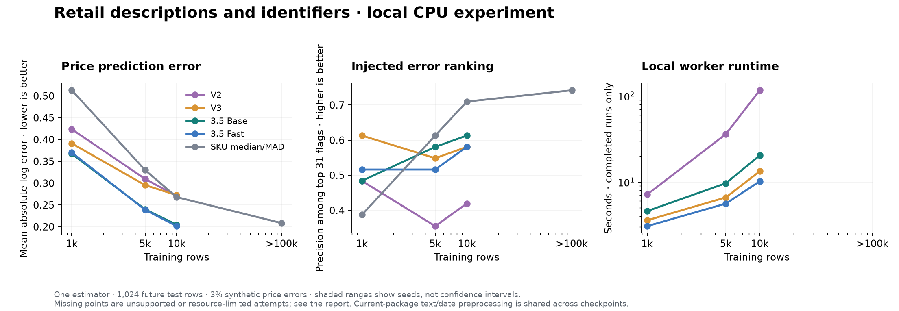

# Retail text and identifier benchmark

This is a new **CPU feasibility experiment**, separate from the completed small-table benchmark. It tests TabPFN directly with a historical training/test split and package text/date preprocessing. TabLint now retains high-cardinality strings and declared categorical IDs as sorted categorical input codes, which is a different preprocessing policy. This pilot must not be presented as a confirmed TabPFN-3.5 advantage or an end-to-end evaluation of TabLint.

## Dataset and task

[UCI Online Retail II](https://archive.ics.uci.edu/dataset/502/online+retail+ii), contributed by Daqing Chen under CC BY 4.0, contains 1,067,371 transaction rows. After removing cancellations, nonpositive prices/quantities, missing descriptions/customers, and exact duplicates, 779,425 rows remain. There are 4,631 stock codes, 5,878 customer IDs and 5,241 descriptions. Descriptions have a median length of 27 characters: these are short product names, not long prose.

Predict log unit price from stock code, description, quantity, invoice date, customer ID and country. Train on transactions before 1 August 2011 and test on later transactions; remove any invoice spanning the boundary. Sample nested contexts of 1,000, 5,000, 10,000 and **100,001 training rows**, with the same 1,024 held-out rows for each seed. Invoice numbers are used only for split validation and never as a feature. Test categories are learned from training data only; unseen identifiers become missing values.

Inject errors into 3% of held-out prices, cycling through ×10, ÷10 and a price swap differing by at least 2×. Original observed prices are references for these artificial errors; they are not independently audited truth. Training references remain uncorrupted. This is a historical-context price-check experiment, not a repeat of TabLint's cross-fitted whole-table evaluation.

## Fair comparison

Compare local V2, V3, V3.5 Base and V3.5 Fast with one estimator, six CPU threads, the same current `tabpfn==9.1.0` text/date preprocessing, and no internal row subsampling. Description is a pandas string; stock code, customer and country are explicitly categorical. The current package encodes text using character n-grams and SVD; this does not test the API-only Plus text system. Version-specific remaining preprocessing defaults are retained and recorded where relevant.

A SKU median/MAD baseline uses the same training rows and falls back to global statistics for unseen SKUs. This is an essential comparator because retail prices often repeat by product. Full-input, no-description and no-identifier runs isolate which inputs help. Report precision at the known injected-error count, AUROC, clean price/log-price error, injected-price correction error, interval coverage, runtime and peak memory. A single seed is only a feasibility pilot; three seeds are specified for an expanded experiment. All versions must use matching completed runs to support paired claims.

V3 already supports large tables and text-related tasks; 100k rows alone does not establish a new 3.5 capability. Measure a benefit rather than assume one. See [the V3 report](https://priorlabs.ai/technical-reports/tabpfn-3) and [V3.5 report](https://priorlabs.ai/technical-reports/tabpfn-3-5).

## Run locally

```bash
# From the repository; no GPU or inference API required.
uv sync
uv run --with openpyxl python -m benchmarks.retail_cpu --prepare
uv run python -m benchmarks.retail_cpu --download
uv run python -m benchmarks.retail_cpu --sizes 1000

# Expand only after inspecting runtime and memory.
uv run python -m benchmarks.retail_cpu --sizes 5000,10000,100001
uv run python -m benchmarks.retail_cpu --sizes 1000 --seeds 1101,1102,1103 --ablations full,no_text,no_ids
```

Dataset and model downloads require network access; inference is local CPU work. The existing accepted Prior Labs model license is needed for V3/3.5 downloads. Raw data and model weights stay in ignored caches.

[`retail_config.json`](../benchmarks/retail_config.json) fixes the dataset checksum, split, seeds, corruption and resource settings before inference. Each worker has a 240-second wall-time budget and an 8 GiB RSS limit, including its child processes; checkpoint downloads are done separately. Exceeding a limit records a timeout or memory failure, never a fabricated score. A CPU-only guard override permits testing above the recommended CPU size, while each checkpoint's actual sample limit remains enforced. Model `fit` and `predict` time are recorded separately from worker startup; wall time includes loading the already-cached model. Peak RSS includes the worker's dataframe and preprocessing.

The retained [`dataset_profile.json`](../results/retail_cpu/dataset_profile.json) records the source and prepared-table hashes, actual cardinalities and split sizes. Run records include configuration/split hashes, input dtypes, completed training size, expanded feature count, model sample limit, actual estimator count and SKU coverage. This makes it possible to distinguish a 100k source dataset, a small sampled context and a completed 100k model run.

The exploratory [compact text profile](../benchmarks/retail_compact_cpu.json) retained 100,001 context rows while reducing description SVD dimensions from 30 to 8. V3 and both 3.5 variants also exceeded the host-memory budget in that retry. Its [raw records](../results/retail_cpu/compact/) are kept separately and are not pooled into the standard-profile graph.

## Continue on another machine

The [handoff protocol](RETAIL_BENCHMARK_HANDOFF.md) includes CUDA/CPU commands, host-memory budget overrides, paired comparisons and ablations. The CUDA path is prepared but has not been validated locally.

## Results

These are measurements using **cpu** and cached local checkpoints. They are a capability pilot with a separate split/preprocessing policy, not an end-to-end TabLint UI evaluation. Synthetic-error metrics concern only the injected errors; naturally unusual prices can also be flagged.

| Context rows | Model | Completed / attempted | Precision@31 | AUROC | Clean log MAE ↓ | Worker seconds | Peak host RSS GiB |
| ---: | --- | ---: | ---: | ---: | ---: | ---: | ---: |
| 1,000 | V2 | 1/1 | 0.484 | 0.939 | 0.423 | 7.1 | 2.36 |
| 1,000 | V3 | 1/1 | 0.613 | 0.911 | 0.391 | 3.6 | 2.67 |
| 1,000 | 3.5 Base | 1/1 | 0.484 | 0.934 | 0.367 | 4.6 | 3.15 |
| 1,000 | 3.5 Fast | 1/1 | 0.516 | 0.944 | 0.370 | 3.1 | 2.66 |
| 1,000 | SKU median/MAD | 1/1 | 0.387 | 0.894 | 0.513 | — | — |
| 5,000 | V2 | 1/1 | 0.355 | 0.940 | 0.310 | 36.1 | 2.47 |
| 5,000 | V3 | 1/1 | 0.548 | 0.963 | 0.295 | 6.6 | 2.74 |
| 5,000 | 3.5 Base | 1/1 | 0.581 | 0.972 | 0.240 | 9.7 | 3.86 |
| 5,000 | 3.5 Fast | 1/1 | 0.516 | 0.970 | 0.239 | 5.6 | 4.04 |
| 5,000 | SKU median/MAD | 1/1 | 0.613 | 0.959 | 0.330 | — | — |
| 10,000 | V2 | 1/1 | 0.419 | 0.930 | 0.270 | 117.0 | 3.69 |
| 10,000 | V3 | 1/1 | 0.581 | 0.933 | 0.272 | 13.3 | 3.81 |
| 10,000 | 3.5 Base | 1/1 | 0.613 | 0.970 | 0.205 | 20.4 | 4.71 |
| 10,000 | 3.5 Fast | 1/1 | 0.581 | 0.965 | 0.201 | 10.2 | 5.84 |
| 10,000 | SKU median/MAD | 1/1 | 0.710 | 0.965 | 0.268 | — | — |
| 100,001 | V2 | 0/1 | — | — | — | — | — |
| 100,001 | V3 | 0/1 | — | — | — | — | — |
| 100,001 | 3.5 Base | 0/1 | — | — | — | — | — |
| 100,001 | 3.5 Fast | 0/1 | — | — | — | — | — |
| 100,001 | SKU median/MAD | 1/1 | 0.742 | 0.980 | 0.208 | — | — |

**Incomplete attempts:**

- V2 / 100,001 rows / seed 1101 / full: **error**, 3.6s, peak 0.95 GiB (when recorded). Number of samples `100,001` in the input data is greater than the maximum number of samples `10,000` officially supported by TabPFN. Set `ignore_pretraining_limits=True` to override this error!

- V3 / 100,001 rows / seed 1101 / full: **memory_limit**, 28.0s, peak 8.15 GiB (when recorded).

- 3.5 Base / 100,001 rows / seed 1101 / full: **memory_limit**, 60.2s, peak 8.71 GiB (when recorded).

- 3.5 Fast / 100,001 rows / seed 1101 / full: **memory_limit**, 18.4s, peak 8.57 GiB (when recorded).



Values average completed seeds; a seed range is descriptive, not a confidence interval. Missing or timed-out models are not assigned scores. Paired quality claims require the same completed seeds at the same context size. Wall time includes worker startup, loading the prepared data and loading cached weights; downloads are excluded. Runtime of the SKU baseline is not directly comparable to the end-to-end model worker because it is measured in the parent process and omitted from that chart.

[Raw measurements](../results/retail_cpu/) · [Machine-readable summary](../results/retail_cpu/summary.csv)
