# TabLint — In the flow

Revision 07 · 72-second motion storyboard · 14 shots · 42 keyframes

[Open interactive motion study](http://127.0.0.1:7080/index.html) · [Production specification](PRODUCTION.md)

Labels stay attached to their fields. Category annotations use separate short horizontal lines, without a shared gutter route. Text types in place; controls use clockwise press highlights.

| Shot | Time | Main beat |
| --- | --- | --- |
| 01 | 0–4s | Open → enter the workspace |
| 02 | 4–7s | Travel through the data |
| 03 | 7–11s | Same number. Different row. |
| 04 | 11–15s | Invoke TabLint |
| 05 | 15–18s | A check becomes visible |
| 06 | 18–24s | The whole row matters |
| 07 | 24–31s | Read the diagnosis |
| 08 | 31–37s | Follow the warning to the Rabbit |
| 09 | 37–42s | Apply → correct → record |
| 10 | 42–46s | Categorical columns, too |
| 11 | 46–54s | Suggest a category. Flag for review. |
| 12 | 54–59s | Every decision has a reason |
| 13 | 59–67s | Undo is an action, not an erasure |
| 14 | 67–72s | Finish with TabLint in use |

## 01 / Open → enter the workspace

**0–4s**

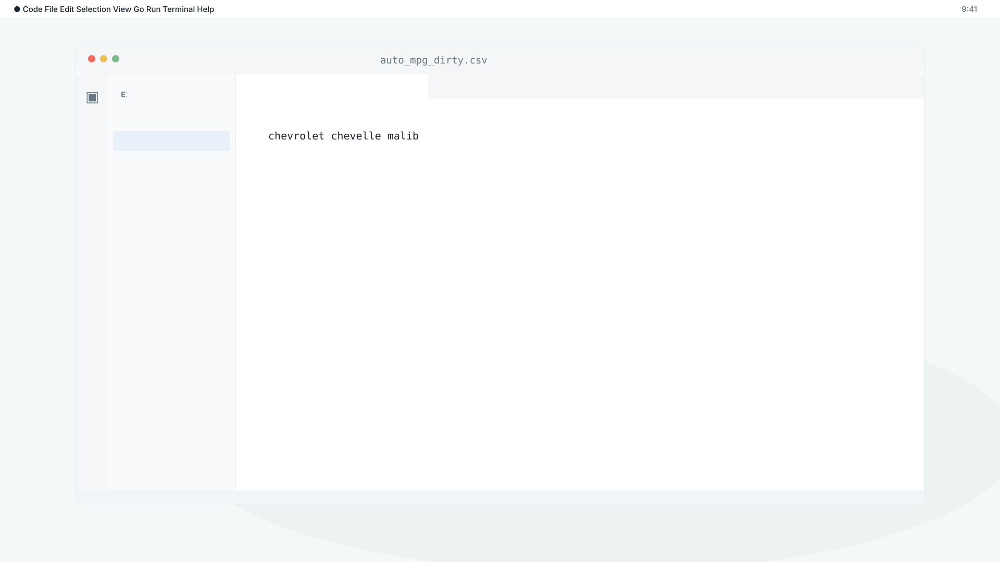

**Action:** The CSV selection gains a teal outline. Its row compresses briefly, then expands into the editor.

**Camera:** A 400ms push from selected file to workspace; settle immediately.

**Transition:** The selected file morphs into its editor tab in 400ms.

**Voiceover:** Start with a table you already have.

**Grounding:** Actual CSV and extension entry point.

[Entry](assets/shot-01-entry.svg) · [Action](assets/shot-01-action.svg) · [Exit](assets/shot-01-exit.svg)

## 02 / Travel through the data

**4–7s**

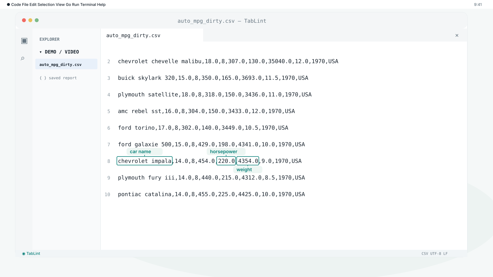

**Action:** Car name, horsepower, and weight labels attach to the exact fields in the Impala row, with short stems and fitted outlines.

**Camera:** A 400ms approach, then a stable inspection of the Impala row.

**Transition:** The active weight token anchors the next row reveal.

**Voiceover:** Ordinary values can hide mistakes.

**Grounding:** Actual CSV line 8: Chevrolet Impala, horsepower 220.0, weight 4354.0.

[Entry](assets/shot-02-entry.svg) · [Action](assets/shot-02-action.svg) · [Exit](assets/shot-02-exit.svg)

## 03 / Same number. Different row.

**7–11s**

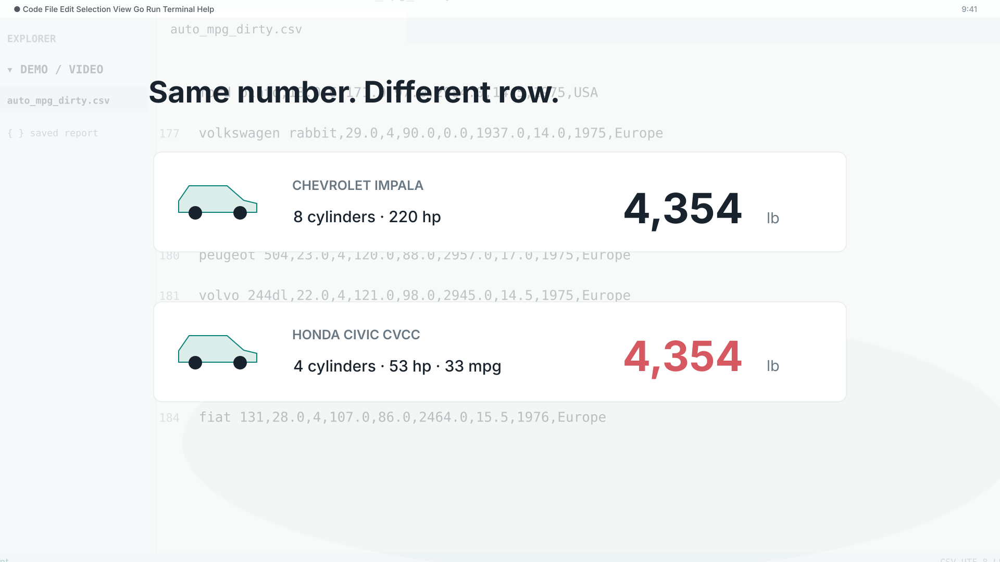

**Action:** The shared weight holds its screen lane while Impala and Civic row ribbons enter with crisp staggered movement.

**Camera:** A 400ms row match; ribbons settle without ongoing drift.

**Transition:** The Civic ribbon returns to CSV line 183 in 380ms.

**Voiceover:** An Impala and a Civic. Same weight, different context.

**Grounding:** Both weights and the car context are from the existing Auto MPG fixtures. These detached ribbons are editorial, not extension UI.

[Entry](assets/shot-03-entry.svg) · [Action](assets/shot-03-action.svg) · [Exit](assets/shot-03-exit.svg)

## 04 / Invoke TabLint

**11–15s**

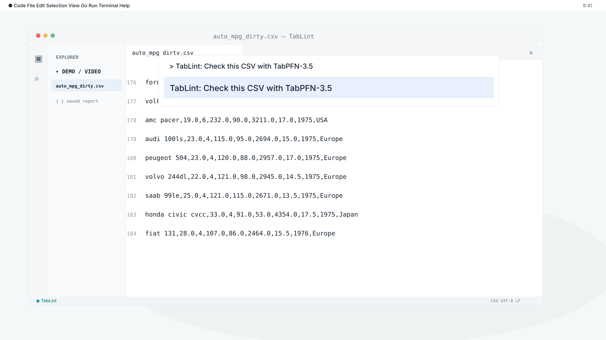

**Action:** The command palette appears in 350ms. Check this CSV receives a selection outline and a brief press pulse; the origin selection follows.

**Camera:** A 400ms return to a face-on desktop; menus appear without a slow camera move.

**Transition:** The command selection compresses and retracts as the label picker enters.

**Voiceover:** Run TabLint in VS Code.

**Grounding:** extension.ts: check(), native VS Code palette and label picker.

[Entry](assets/shot-04-entry.svg) · [Action](assets/shot-04-action.svg) · [Exit](assets/shot-04-exit.svg)

## 05 / A check becomes visible

**15–18s**

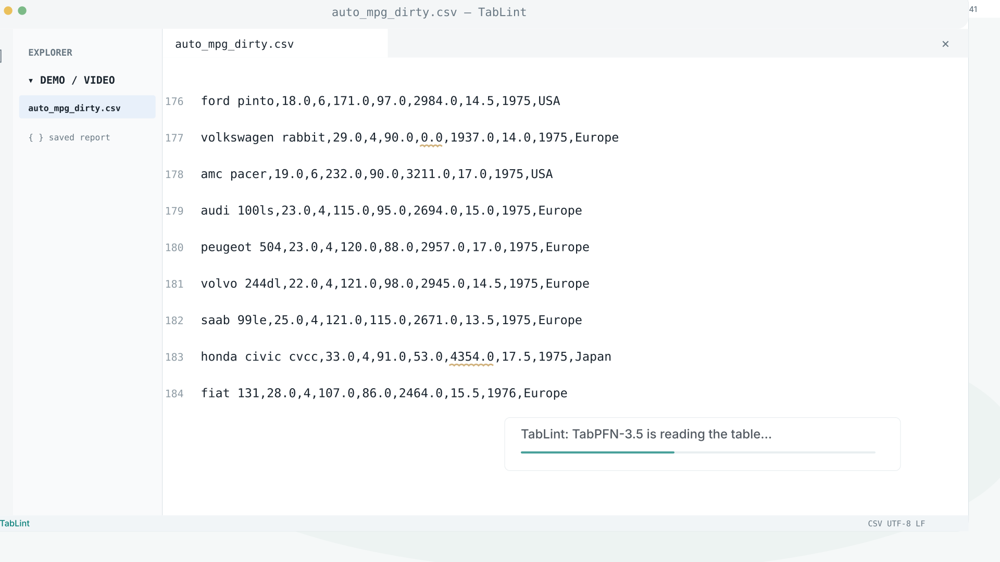

**Action:** A time-compressed progress notification appears. The notification clears, then diagnostic underlines appear on their exact fields. No extra status badge is shown.

**Camera:** A 400ms approach to the warning, followed by a stationary view.

**Transition:** The active underline expands into the row-context overlay.

**Voiceover:** Flags appear where you work.

**Grounding:** Actual progress wording. No runtime or issue count will be invented.

[Entry](assets/shot-05-entry.svg) · [Action](assets/shot-05-action.svg) · [Exit](assets/shot-05-exit.svg)

## 06 / The whole row matters

**18–24s**

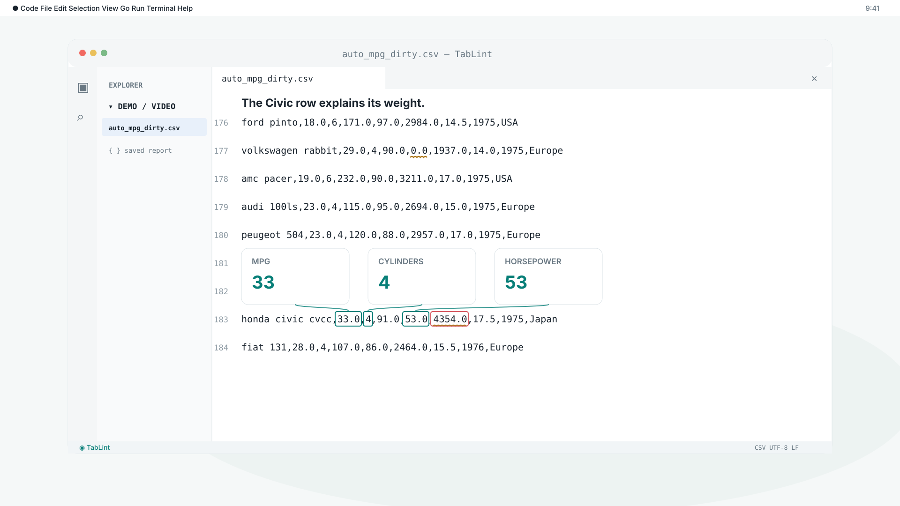

**Action:** MPG, cylinders, and horsepower cards connect to the exact values in the Civic CSV row. Its weight stays outlined in the table.

**Camera:** Keep the native Civic row face-on; lock the camera while its context is explained.

**Transition:** The source values remain in place as the context cards retract in 380ms.

**Voiceover:** Every value is checked against its row.

**Grounding:** Civic context: 33 mpg, 4 cylinders, 53 hp. Cinematic anatomy overlay is editorial.

[Entry](assets/shot-06-entry.svg) · [Action](assets/shot-06-action.svg) · [Exit](assets/shot-06-exit.svg)

## 07 / Read the diagnosis

**24–31s**

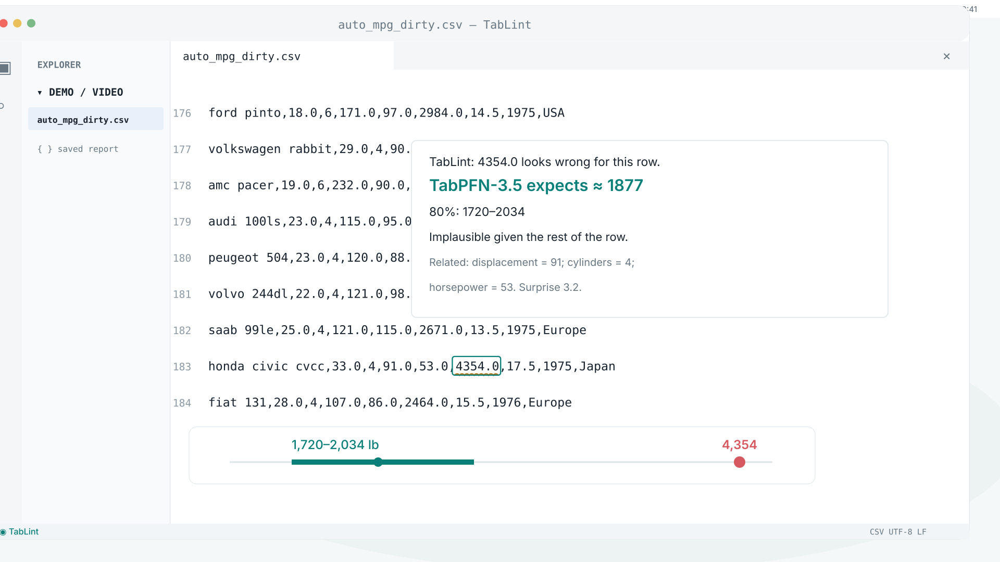

**Action:** The weight field receives a focus outline. Its diagnostic opens in 350ms and the interval diagram resolves in 240ms.

**Camera:** Settle in 400ms, then lock while the diagnosis is read.

**Transition:** The interval collapses; the active-row band initiates a quick upward sweep.

**Voiceover:** For this Civic, the model expects about 1,877 pounds. Review the source.

**Grounding:** Frozen numeric report: expected 1877; 80% 1720–2034; surprise 3.24. The interval track is an editorial diagram.

[Entry](assets/shot-07-entry.svg) · [Action](assets/shot-07-action.svg) · [Exit](assets/shot-07-exit.svg)

## 08 / Follow the warning to the Rabbit

**31–37s**

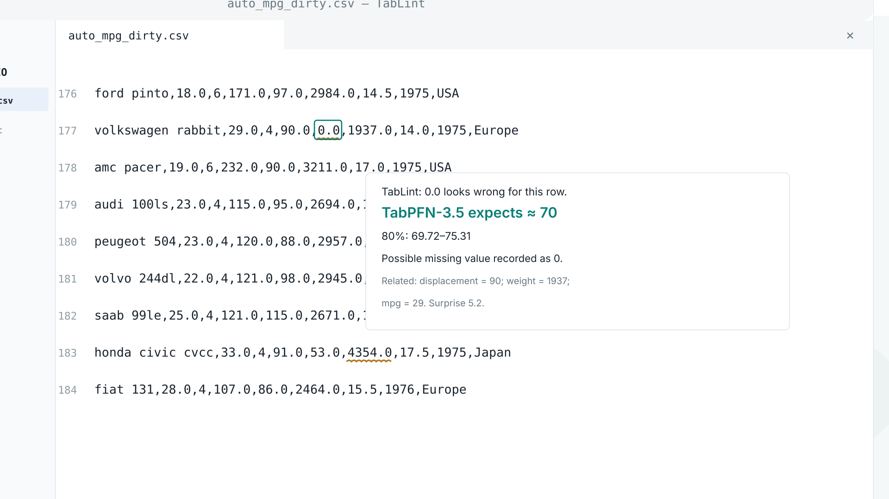

**Action:** An active-row band travels six lines upward in 400ms. The zero field is outlined and its diagnostic appears.

**Camera:** One fast 400ms row track with smooth deceleration; then a reading hold.

**Transition:** The diagnostic retracts into the Quick Fix selection.

**Voiceover:** Zero horsepower looks like a missing value. The suggestion is seventy.

**Grounding:** Rabbit line 177. Saved range 69.72–75.31 hp; answer key confirms original 70.

[Entry](assets/shot-08-entry.svg) · [Action](assets/shot-08-action.svg) · [Exit](assets/shot-08-exit.svg)

## 09 / Apply → correct → record

**37–42s**

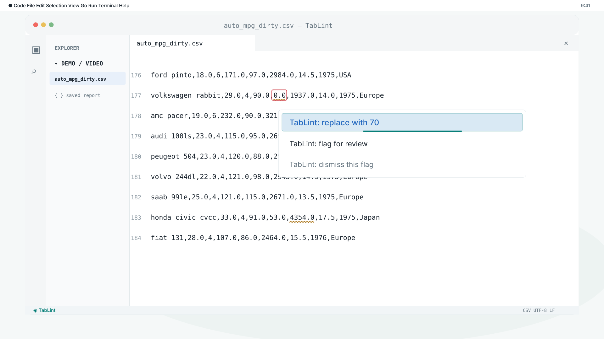

**Action:** Replace with 70 gains a teal selection outline with a clockwise perimeter highlight. The table’s horsepower changes from 0.0 to 70 in place, its highlight follows that field, and a receipt records the reason.

**Camera:** A quick 380ms adjustment after the press; no floating camera drift.

**Transition:** A 350ms receipt move leads into the categorical tab selection.

**Voiceover:** Apply the fix. Keep the reason.

**Grounding:** Exact Code Action labels. The receipt is an editorial representation of the persistent ledger event.

[Entry](assets/shot-09-entry.svg) · [Action](assets/shot-09-action.svg) · [Exit](assets/shot-09-exit.svg)

## 10 / Categorical columns, too

**42–46s**

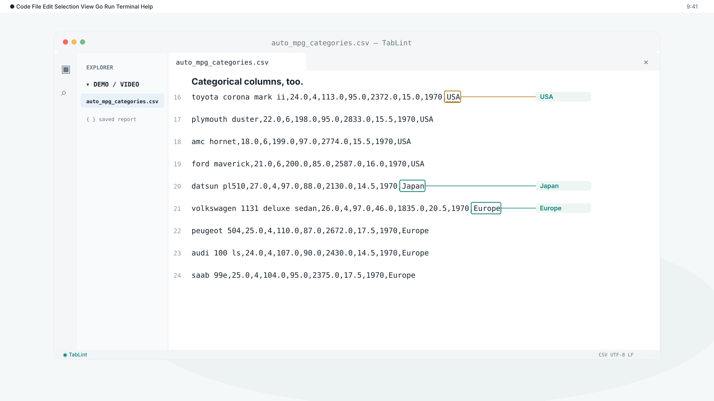

**Action:** The categorical CSV tab gains a selection outline. USA, Japan, and Europe labels sit beside their own rows, each connected by a short independent horizontal line.

**Camera:** Keep all three origin fields visible; labels remain level with their source values.

**Transition:** The category labels retract in 380ms; Toyota’s USA field anchors the diagnosis.

**Voiceover:** Categorical columns, too.

**Grounding:** Actual CSV lines 16, 20, and 21 show USA, Japan, and Europe. The Toyota suggestion remains provisional pending measured inference.

[Entry](assets/shot-10-entry.svg) · [Action](assets/shot-10-action.svg) · [Exit](assets/shot-10-exit.svg)

## 11 / Suggest a category. Flag for review.

**46–54s**

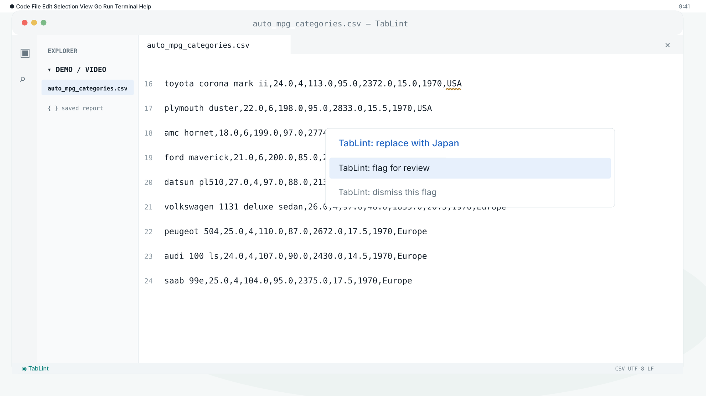

**Action:** The origin field is outlined. The category suggestion appears, then Flag for review gains its own selection and clockwise perimeter highlight. A review note is entered.

**Camera:** A 400ms face-on approach; focus feedback identifies the chosen option.

**Transition:** The confirmed note becomes its file’s ledger note with a 350ms match.

**Voiceover:** Flag uncertain values for source review.

**Grounding:** Real Quick Fix and flag-note controls. Category suggestion shown is a storyboard placeholder, not a measured result.

[Entry](assets/shot-11-entry.svg) · [Action](assets/shot-11-action.svg) · [Exit](assets/shot-11-exit.svg)

## 12 / Every decision has a reason

**54–59s**

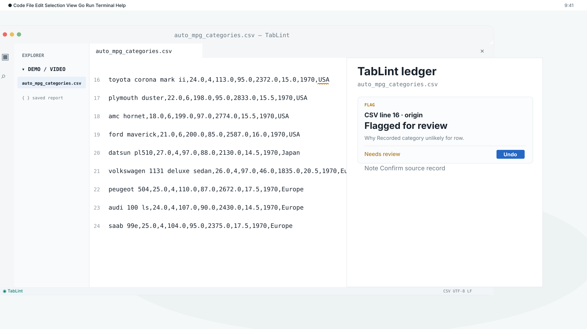

**Action:** Open decision ledger is selected and pulsed. Its panel enters in 400ms, retaining the categorical review reason and note.

**Camera:** A 400ms horizontal slide into the ledger, followed by a stable split view.

**Transition:** A 350ms tab-selection match switches to the numeric CSV and its own history.

**Voiceover:** Every decision keeps its reason.

**Grounding:** Ledger webview and append-only sidecar are implemented. Production uses a single CSV ledger per view; category and numeric records will be shown in their own file views.

[Entry](assets/shot-12-entry.svg) · [Action](assets/shot-12-action.svg) · [Exit](assets/shot-12-exit.svg)

## 13 / Undo is an action, not an erasure

**59–67s**

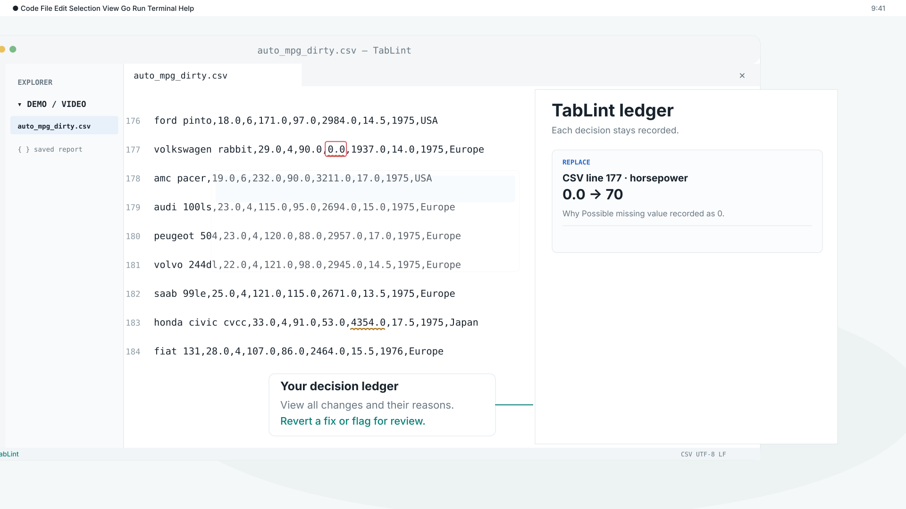

**Action:** A white callout points to the decision ledger: view all changes and their reasons, revert a fix, or flag for review. Undo restores zero and preserves history; reapply adds a new Applied record.

**Camera:** A 400ms two-plane adjustment; keep both value and ledger visible.

**Transition:** The corrected cell and two history records settle before the final pullback.

**Voiceover:** View every change and its reason. Revert a fix, or flag a value for review.

**Grounding:** Actual undo behavior preserves its event history and refuses to overwrite newer edits. The white explanation box is an editorial annotation anchored to the ledger panel.

[Entry](assets/shot-13-entry.svg) · [Action](assets/shot-13-action.svg) · [Exit](assets/shot-13-exit.svg)

## 14 / Finish with TabLint in use

**67–72s**

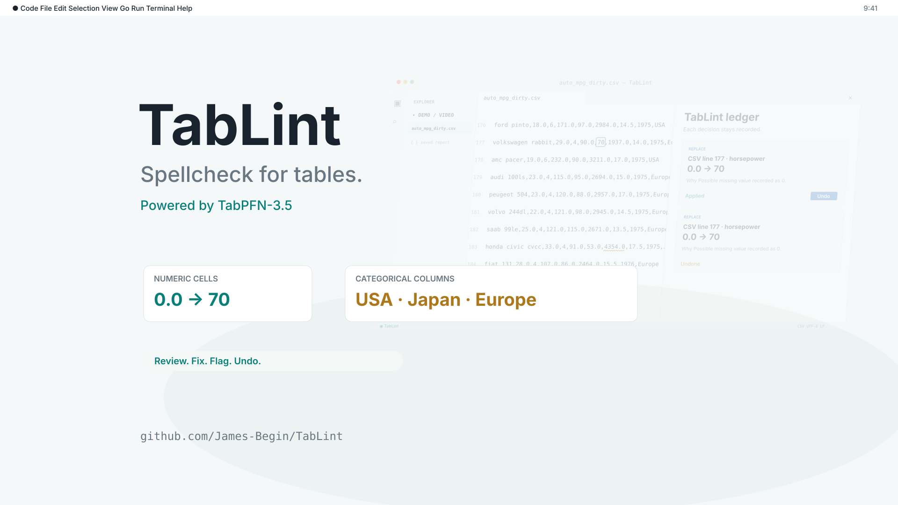

**Action:** The corrected workspace contracts into the brand composition in 450ms. Numeric and categorical chips enter quickly; TabLint holds on screen.

**Camera:** A 450ms pullback, then a stable brand hold.

**Transition:** Finish with a clean hold; no ambient drift or prolonged fade.

**Voiceover:** Numbers. Categories. Decisions that stay yours. TabLint.

**Grounding:** Avoid benchmark text walls in this product showcase; evidence stays in the submission supporting material.

[Entry](assets/shot-14-entry.svg) · [Action](assets/shot-14-action.svg) · [Exit](assets/shot-14-exit.svg)
